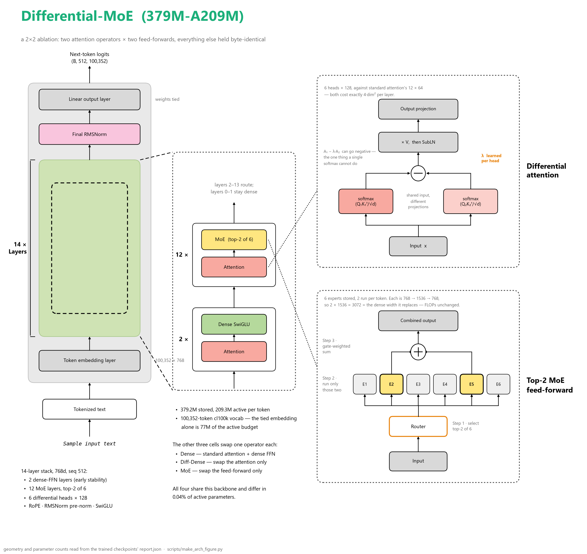
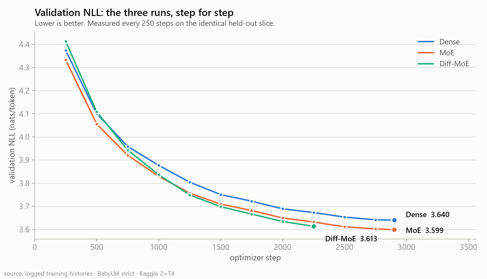
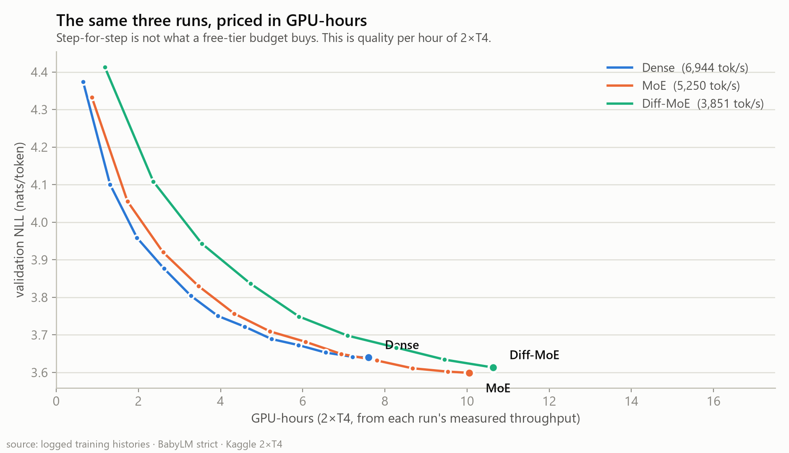
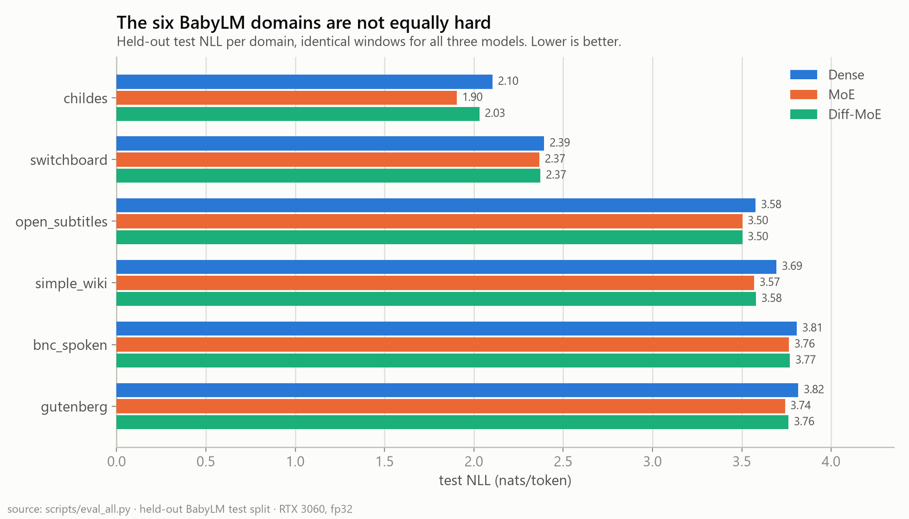
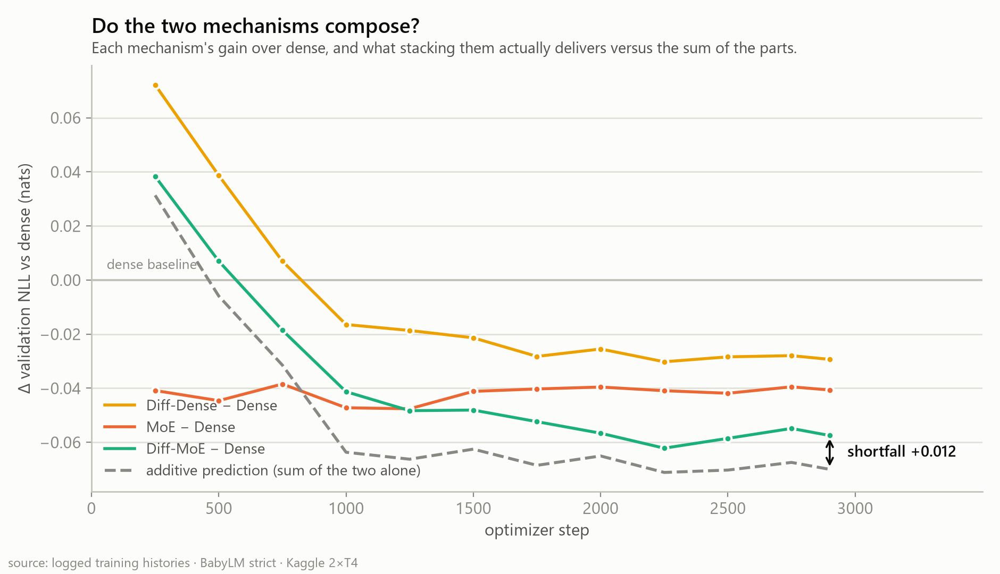

# Differential-MoE

**Do two of the most-hyped transformer tricks — Differential Attention and Mixture-of-Experts — actually earn their place in a language model? A controlled 2×2 ablation, trained from scratch, on a free Kaggle GPU.**

Most architecture claims are demos: one model, every switch on, no baseline. This project is the opposite — four models that differ in *exactly one thing at a time*, at matched compute, on identical data, so every difference is attributable. Then the mechanisms are opened up and checked directly: not just *does* it help, but *does it help for the reason its paper claims*.

| | |
|---|---|
| **The grid** | {standard, differential} attention × {dense, MoE} feed-forward |
| **Scale** | 209M active params · 768d × 14 layers · [BabyLM](https://babylm.github.io/) corpus, 190M tokens/run |
| **Hardware** | trained on Kaggle's free 2×T4 · evaluated on one RTX 3060 |
| **Everything held fixed** | seed, data order, LR schedule, token budget, eval windows — byte-identical |



*The diagram shows **Diff-MoE**, the cell with both mechanisms switched on. The other three are ablations of it — swap the attention, swap the feed-forward, or neither. Every number in it is read from the trained checkpoints' own `report.json`.*



## Findings in 30 seconds

1. **Sparsity wins biggest.** MoE beats the dense baseline by **−0.129 nats** on held-out test at identical active compute — better on **96% of individual test windows**, in all six corpus domains.
2. **Differential attention works, and it's nearly free.** −0.028 nats over dense for a **3.9% throughput cost**. It's the best use of a fixed GPU-hour budget of all four models.
3. **It works for the claimed reason** — verified, not assumed. Its advantage is ~zero at the start of a sequence and **grows with context position** (r = −0.88); its learned λ almost perfectly controls how much attention mass goes *negative* (r ≈ 0.98) — the one thing an ordinary softmax cannot do.
4. **Stacking both buys less than the sum — and one domain explains why.** Combining them recovers only **56%** of the two individual gains on held-out test. Diff-MoE beats plain MoE on **5 of 6 domains**; its entire deficit is child-directed speech, and 400 extra training steps barely moved it, so it is **architectural, not undertraining**. Resample *domains* rather than windows and that deficit crosses zero — it is a fact about this corpus mixture, not an architecture-level verdict.
5. **The ranking flips with the axis you measure on.** Best per step: Diff-MoE. Best per GPU-hour: Diff-Dense. Best absolute test NLL: MoE. *No single number answers "which architecture is best" — that's the point.*

**The honest caveat:** every cell is one seed. Test-set sampling error is ruled out (19–63σ, paired bootstrap), but seed-to-seed variance is unmeasured — so treat small differences as strong hints, not laws.

---

## The 2×2 at a glance

| Run | Attention | FFN | The question it answers | Val NLL (2900 steps) | Test NLL |
|-----|-----------|-----|-------------------------|---------|---------|
| A | standard | dense | baseline | 3.640 | 3.052 |
| B | differential | dense | does diff-attn help *alone*? | 3.610 | **3.024** |
| C | standard | MoE top-2 | does sparsity help *alone*? | 3.599 | **2.923** |
| D | differential | MoE top-2 | do they *compose*? | **3.582** | 2.963 |

All four cells are complete 2,900-step runs, evaluated on byte-identical held-out windows.

**Fairness is enforced in code and guarded by tests, not asserted:** differential attention runs half the heads at double width (both variants cost exactly `4·dim²`/layer), and each expert's width is `dense_inter ÷ top_k` so the two routed experts sum exactly to the dense FFN they replace. Models B–D differ from A by **0.01–0.04%** in active parameters.

---

## The three headline plots

**Cost, priced honestly.** Iso-step comparisons hide the bill. Same curves against GPU-hours:



| In a fixed 7.6 GPU-h | Val NLL | | tok/s |
|---|---|---|---|
| **Diff-Dense** | **3.613** | ← best on a time budget | 6,674 |
| Diff-MoE | 3.620 | | 5,139 |
| MoE | 3.636 | | 5,250 |
| Dense | 3.640 | | 6,944 |

**The mechanism, verified.** Differential attention's advantage over dense is ~zero at position 0 and grows across the context window — exactly what a noise-cancelling mechanism must do, and not what a capacity mechanism (MoE, orange) does. Left panel is all four cells in absolute terms; right panel is the same data measured against dense:


**The two mechanisms fix different text — and that is why they stack badly.** MoE's gain concentrates on repetitive child-directed speech; diff-attn's on topic-switching, reference-dense text. Their per-domain gain profiles correlate at only **r = 0.21**:



| Domain | Dense | Diff-Dense | MoE | Diff-MoE | MoE − Dense | Diff-MoE − MoE |
|---|---|---|---|---|---|---|
| childes | 2.104 | 2.090 | **1.904** | 2.027 | **−0.200** | **+0.123** ✗ |
| switchboard | 2.394 | 2.388 | 2.367 | **2.363** | −0.027 | −0.004 ✓ |
| open_subtitles | 3.577 | 3.539 | 3.503 | **3.493** | −0.074 | −0.010 ✓ |
| simple_wiki | 3.694 | 3.635 | 3.569 | **3.547** | −0.125 | **−0.022** ✓ |
| bnc_spoken | 3.808 | 3.786 | 3.764 | **3.754** | −0.044 | −0.010 ✓ |
| gutenberg | 3.816 | 3.801 | 3.741 | **3.737** | −0.075 | −0.004 ✓ |

Read the last column: **Diff-MoE beats plain MoE on five of six domains**, then gives all of it back and more on CHILDES — which is 40% of the test set. Finishing the crashed run moved that gap by only 0.004 (+0.127 → +0.123), which **rules out undertraining as the explanation**. Differential attention genuinely costs something on short, repetitive, locally-predictable text: there is no attention noise worth cancelling over a three-word context, and the frequency-decile data shows it trading common-token fluency for rare-token accuracy.

---

<details>
<summary><b>📊 Full results & statistics</b> — paired bootstrap CIs, win rates, domain-clustered intervals</summary>

**Why these metrics, in one paragraph.** **NLL** (nats/token) is the training objective itself — differences in it are additive and comparable, which is why every statistical test here runs on NLL. **Perplexity** is just `exp(NLL)`, read as "how many equally-likely next tokens is the model effectively choosing between" — intuitive, but exponential, so it exaggerates (a 4.2% NLL gain shows up as 12.1% perplexity). **bits/byte** normalises by raw UTF-8 bytes instead of tokens, making it the only number here that stays valid across different tokenizers — and it is literally a compression rate: 1.131 → 1.083 means the archive is 4.2% smaller. **Top-1** is how often the single best guess is exactly right, roughly an autocomplete acceptance rate; MoE's +0.8pp is about one extra correct token per 122. **Win rate** — the share of individual windows a model wins — is the one that changes rollout decisions: a 96% win rate is safe to ship, a 69% win rate means one document in three gets *worse* while your average looks green. Six evaluation passes produced everything below — overall quality, paired and domain-clustered uncertainty, position-resolved NLL, attention statistics, and BLiMP — and four of them found things a single perplexity number would have got wrong.

### Held-out test (3,200 identical windows, 1.64M tokens, fp32)

| Run | Test NLL | PPL | bits/byte | Top-1 | Raw / Active params |
|---|---|---|---|---|---|
| Dense | 3.052 | 21.15 | 1.131 | 0.462 | 209.2M / 209.2M |
| Diff-Dense | 3.024 | 20.57 | 1.120 | 0.466 | 209.2M / 209.2M |
| **MoE** | **2.923** | **18.59** | **1.083** | **0.470** | 379.1M / 209.3M |
| Diff-MoE | 2.963 | 19.36 | 1.098 | **0.471** | 379.2M / 209.3M |

### Paired bootstrap (20,000 resamples; identical windows make every comparison paired)

| Comparison | Δ test NLL | iid 95% CI | domain-clustered 95% CI | Windows won |
|---|---|---|---|---|
| MoE − Dense | −0.129 | [−0.134, −0.124] | [−0.142, −0.051] | **96.0%** |
| Diff-Dense − Dense | −0.028 | [−0.030, −0.026] | [−0.044, −0.016] | **69.2%** |
| Diff-MoE − Dense | −0.088 | [−0.091, −0.086] | [−0.113, −0.057] | **95.1%** |
| Diff-MoE − Diff-Dense | −0.060 | [−0.063, −0.058] | [−0.072, −0.038] | **91.0%** |
| Diff-MoE − MoE | +0.041 | [+0.037, +0.045] | [**−0.016**, +0.055] | 47.7% |

All five rows are the completed 2,900-step checkpoints.

Three things these rows teach:

- **The iid intervals are 19–63σ from zero** — test-set size limits nothing here. The only unmeasured noise source is the seed.
- **Windows aren't exchangeable** — they share domains. Resampling the *domains* widens every interval 6.5–10.3×, and one comparison does not survive it: **Diff-MoE − MoE crosses zero** once domains rather than windows are the unit, because that gap lives almost entirely in CHILDES (40% of test windows). So "plain MoE beats Diff-MoE" is a claim about *this domain mixture*, not a claim that would survive reweighting the corpus. An error bar is only as honest as its exchangeability assumption.
- **Win rate separates two kinds of improvement.** MoE wins 96% of windows (broad shift); diff-attn wins 69% — worse on one window in three, its mean carried by big wins on a minority. Frequency-decile analysis shows why: diff-attn trades common-token fluency for rare-token accuracy.

### BLiMP (grammatical competence, 67k minimal pairs, chance 50%)

| Dense | Diff-Dense | MoE | Diff-MoE |
|---|---|---|---|
| 70.50% | 70.62% | **71.39%** | 71.14% |

The perplexity ranking transfers exactly to grammar (r = −0.99 with test NLL — all four models order identically on both). MoE's +0.9pp is real; differential attention's +0.1pp overall is noise — but by field it gains **+3.1pp on semantics** while giving back 1.3pp on syntax, the third independent measurement concentrating its value where meaning depends on distant context.

### Interaction: do they compose?

Two views, and the disagreement between them is the interesting part.

| | MoE alone | diff-attn alone | additive prediction | combined actual | recovered |
|---|---|---|---|---|---|
| **Validation** (step 2900) | −0.041 | −0.029 | −0.070 | −0.058 | **82%** |
| **Held-out test** | −0.129 | −0.028 | −0.157 | −0.088 | **56%** |

Test is far more sub-additive than validation — because the validation slice is BNC-only, and **the entire interaction shortfall lives in CHILDES**, a domain validation never sees. See the per-domain table above.



</details>

<details>
<summary><b>🔬 Mechanism deep-dive</b> — attention matrices recomputed, λ analysis, negative mass</summary>

The fused attention kernel never materialises attention weights, so both attention forwards were reimplemented to capture them ([`scripts/eval_attention.py`](scripts/eval_attention.py)), verified against the originals to 5×10⁻⁷. Shannon entropy is undefined on differential rows (signed, sum to 1−λ), so spread is measured on normalised magnitudes.

| Model | Effective support (positions/row) | Top-8 mass | **Negative attention mass** |
|---|---|---|---|
| Dense | 86.2 | 0.380 | 0 |
| Diff-Dense | **70.8** | 0.428 | **31.3%** |
| MoE | 75.6 | 0.419 | 0 |
| Diff-MoE | **50.2** | 0.503 | **32.4%** |

The full causal chain, each link measured independently:

> λ learned per layer → controls negative attention mass (**r = +0.98/+0.99** across 14 layers) → attention sharpens (−18% effective support) → advantage grows with context position (**r = −0.88**).

λ itself: kept the paper's increasing-with-depth shape but pushed layer 0 down to 0.11 (init 0.20) — and the two differential models converged on nearly the same profile (r = 0.92) despite entirely different feed-forwards underneath.

**Controls that limit the claim:** MoE with ordinary softmax *also* sharpened (75.6 vs 86.2) — sharpening is a property of better models here, not of this mechanism; only the negative mass is uniquely differential. And sharpness does not predict quality (r = +0.45 with test NLL, and the sharpest model of the four is not the best).

Routing stayed healthy in both MoE cells (per-domain entropy ≥ 0.996, no collapse) and experts did **not** specialize by domain (max TV from uniform 0.052) — the load-balance loss suppresses exactly the specialization the six-domain corpus invites. `aux_loss_coef` is the unswept knob.

</details>

<details>
<summary><b>⚠️ How to read these numbers</b> — the caveats, stated rather than buried</summary>

- **One seed per cell** (`seed=42`). Sampling error is solved; seed variance is not measured. This is the binding constraint on every small difference here — and an earlier conclusion of this project reversed when a second measurement of the same quantity arrived.
- **A long-context mechanism at 512 tokens.** Diff-attn's advantage is still growing at position 500 with no flattening — extrapolation says longer contexts help more, but that's a prediction, not a result.
- **The head-count confound.** Parity buys λ by halving heads; "differential attention" here means "subtraction minus half the patterns." One deliberately parity-breaking run would separate them.
- **Throughput lesson learned twice.** Diff-attn initially measured as costing 27% inside the MoE — a rerun on a healthy Kaggle session showed 2%, matching the dense pair's 3.9%. The first session ran on contended hardware. A cost measured once is a property of that setup, not the mechanism.
- **One LR for four architectures; training-time validation was a single domain** (fixed slice = BNC only — comparisons stayed fair, but checkpoint selection saw one domain).
- **~15× under Chinchilla-optimal on purpose** (BabyLM's premise). No run ever overfit; rankings at 1.1 epochs need not hold at 5.
- **209M params is not 70B.** Everything here is a statement about this scale.

</details>

<details>
<summary><b>🏗️ Architecture & implementation</b></summary>

See the [architecture diagram](#differential-moe) at the top for how these fit together.

| Component | Design |
|---|---|
| Attention | `StandardAttention` (SDPA) or `DifferentialAttention` — half heads, double width, matched cost |
| Feed-forward | Dense SwiGLU, or top-k routed MoE + Switch-style load-balance loss + router z-loss |
| Positions / Norm | RoPE · RMSNorm pre-norm |
| Precision | fp16 AMP + GradScaler (T4 has no bf16); router softmax and λ in fp32 |
| Tokenizer | cl100k via `hf:` spec (tier S) or custom byte-BPE with fertility-swept vocab (tier A/B) |
| Data | six BabyLM domains packed into one memmapped token stream, 512-token windows, no padding |
| Distributed | optional DDP, one flag |

Geometry was tuned at runtime on Kaggle (dim 896→768, 8→6 experts) to fit T4 VRAM — an MoE holds *all* experts plus fp32 AdamW state (~16 B/param). Evaluation therefore reconstructs each model's config **from checkpoint tensor shapes**, not from YAML.

</details>

<details>
<summary><b>▶️ Reproduce</b> — data prep, training, the full evaluation battery</summary>

```bash
python -m venv venv && source venv/bin/activate   # venv\Scripts\activate on Windows
pip install -r requirements.txt

# 1 · tokenize once (CPU) and verify before spending GPU
python -m src.data.prepare --tokenizer hf:Xenova/gpt-4 --out_dir data_s --track strict
python -m src.data.verify  --data_dir data_s --config configs/s_moe.yaml

# 2 · parameter counts (never hand-computed -- parity is the whole experiment)
python -m src.params --config configs/s_dense.yaml configs/s_moe.yaml

# 3 · train (re-running auto-resumes from last.pt)
torchrun --standalone --nproc_per_node=2 -m src.train \
    --config configs/s_moe.yaml --data_dir data_s --ddp --wandb

# 4 · the evaluation battery, cheapest first
python scripts/eval_all.py                  # NLL/ppl/bpb/top-1, per-domain, routing
python scripts/eval_uncertainty.py          # paired bootstrap CIs + win rates
python scripts/eval_bootstrap_clustered.py  # domain-clustered CIs (CPU only)
python scripts/eval_deep.py                 # NLL by position, calibration, freq deciles
python scripts/eval_attention.py            # attention matrices: entropy, negative mass

# 5 · every figure in this README
python scripts/make_figures_part1.py
```

For the one-click Kaggle path see `notebooks/`.

</details>

<details>
<summary><b>📁 Project structure & tests</b></summary>

```
configs/      the 2×2 at three scales (a_*, s_*, b_final)
src/
  model/      attention.py (both variants) · moe.py · block.py · transformer.py
  data/       babylm.py · tokenizer.py · prepare.py · verify.py · dataset.py
  train.py    AMP, accumulation, checkpoint/resume, DDP, W&B
  eval.py     NLL, ppl, bits/byte, expert utilization, λ logging
  params.py   raw vs active parameter accounting
scripts/      the evaluation battery + figure generation (see Reproduce)
assets/       rendered figures
tests/        gradient flow, causality, parameter parity, router balance,
              single-batch overfit, resume correctness, token storage round-trip
```

```bash
pytest tests/
```

Each test targets a failure this codebase actually had or would silently tolerate — a gradient that never arrives, a vocabulary that overflows its dtype, an attention that leaks the future — rather than restating what the code does.

</details>

---

## Why this project looks the way it does

**Small scale is a microscope, not a compromise.** At 209M params and a fixed 167M-token corpus, a full run costs hours on free hardware — which makes a *grid* affordable, and grids are what turn claims into measurements. What small scale cannot promise is that the ordering holds at 70B; nothing at this budget can.

**BabyLM was chosen for its structure, not its size.** Six labelled domains (child speech, dialogue, prose, subtitles, Wikipedia, phone calls) give MoE routing something real to specialize on — and give every per-domain analysis above its ground truth.

A three-part narrative write-up — the plan and the sparse pair, the dense pair and the mechanism verification, and a post on the evaluation battery itself — is maintained separately from this repository.

## References

- Ye, T. et al. — *Differential Transformer*, 2024
- DeepSeek-AI — *DeepSeek-V2/V3* technical reports (MoE routing design)
- Charpentier, L. et al. — *The BabyLM Challenge: Sample-Efficient Pretraining on Developmentally Plausible Corpora*

## License

MIT
