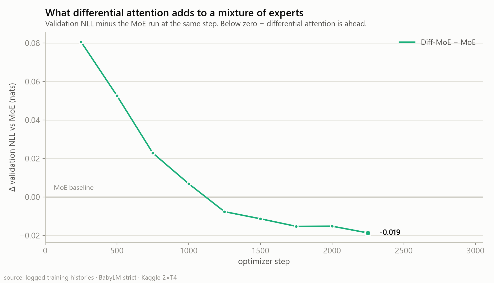

# Differential-MoE

**A controlled 2×2 ablation of Differential Attention × Mixture-of-Experts, trained from scratch on the BabyLM corpus — on a free Kaggle GPU.**

Two ideas from recent language-model research, crossed against each other at matched active-parameter cost, with every other variable held fixed. The point is a clean answer, not a large model.

- **Differential Attention** ([Ye et al., 2024](https://arxiv.org/abs/2410.05258)) — two softmax attention maps per layer, subtracted, to cancel attention noise.
- **Mixture of Experts** — sparse top-2 routing over a bank of feed-forward experts, with a load-balance loss and router z-loss.

| | |
|---|---|
| **Corpus** | [BabyLM](https://babylm.github.io/) *strict* — 167.5M train / 17.3M val / 16.1M test tokens (cl100k), 6 domains |
| **Models** | 209M active · 379M raw · 768d × 14 layers · 100k vocab |
| **Budget** | 2,900 steps × 65,536 tokens = 190M tokens/run · Kaggle 2×T4 |
| **Status** | 3 of 4 runs trained and evaluated · Run B (Diff-Dense) pending |

---

## Results

Three of the four cells are trained. Every number below is measured — logged during training or produced by [`scripts/eval_all.py`](scripts/eval_all.py) re-running each checkpoint over **identical** held-out windows.

### Held-out test set

Full six-domain BabyLM test split, 3,200 windows (1.64M tokens) spread evenly across it, same windows for every model, fp32.

| Run | Attention | FFN | Steps | Test NLL | PPL | bits/byte | Top-1 | Raw | Active |
|---|---|---|---|---|---|---|---|---|---|
| A · Dense | standard | dense | 2900 | 3.052 | 21.15 | 1.131 | 0.462 | 209.2M | 209.2M |
| **C · MoE** | standard | MoE top-2 | 2900 | **2.923** | **18.59** | **1.083** | **0.470** | 379.1M | 209.3M |
| D · Diff-MoE | differential | MoE top-2 | 2500 ⚠️ | 2.977 | 19.62 | 1.103 | 0.469 | 379.2M | 209.3M |
| B · Diff-Dense | differential | dense | — | *not yet run* | | | | | |

⚠️ The Diff-MoE session hit a Kaggle timeout at step 2500 of 2900, so its test number comes from a run 14% shorter than the others. Step-matched comparisons below are unaffected.

### Sparsity pays, consistently


At matched steps, the MoE run beat the dense baseline at **every single one of twelve checkpoints** — mean **−0.042 nats** — at identical active-parameter cost. On the full test split the gap widens to **−0.129 nats**.

*(Those twelve checkpoints are autocorrelated points on one trajectory from one seed, so their spread is a consistency check, not an error bar. Test-set sampling error is quantified by `scripts/eval_uncertainty.py`; seed-to-seed variance is **not** measured anywhere in this project and is the larger unknown.)*

That widening is not noise. Training-time validation reads a fixed slice that turns out to be entirely `bnc_spoken`, which is precisely the domain where MoE helps *least*:


| Domain | Dense | MoE | Diff-MoE | MoE − Dense |
|---|---|---|---|---|
| childes | 2.104 | **1.904** | 2.031 | **−0.200** |
| switchboard | 2.394 | **2.367** | 2.373 | −0.027 |
| open_subtitles | 3.577 | **3.503** | 3.503 | −0.074 |
| simple_wiki | 3.694 | **3.569** | 3.579 | −0.125 |
| bnc_spoken | 3.808 | **3.764** | 3.770 | −0.044 |
| gutenberg | 3.816 | **3.741** | 3.761 | −0.075 |

### Differential attention: a small win on steps, a clear loss on hours



Differential attention **starts as a handicap** (+0.081 nats behind at step 250), closes steadily, crosses over near **step 1250**, and ends 0.019 nats ahead at step 2250. λ needs time to settle, and the parity rule buys those λs by halving the head count — both costs are front-loaded.

Then you price it:


| Run | tok/s (2×T4) | vs Dense | Hours for 2,900 steps | Val NLL in a fixed 7.6 h |
|---|---|---|---|---|
| Dense | 6,944 | 1.00× | 7.6 h | 3.640 |
| **MoE** | 5,250 | 0.76× | 10.1 h | **3.636** |
| Diff-MoE | 3,851 | 0.55× | 13.7 h | 3.684 |

The Diff-MoE curve sits **above both others for its entire run**. MoE wins on both axes — per step *and* per GPU-hour. Differential attention costs another 27% throughput on top of MoE's for an edge that only appears after step 1250, and disappears entirely once hours rather than steps are the budget.

### Routing stayed healthy; experts did not specialize by domain

Both MoE runs kept the load-balance loss pinned near its theoretical floor (12.0 for 12 MoE layers) and routing entropy at the ceiling — no expert collapse:

| Run | Routing entropy (min/mean) | Load imbalance (max) | Domain specialization (max TV from uniform) |
|---|---|---|---|
| MoE | 0.9996 / 0.9999 | 1.066 | 0.052 |
| Diff-MoE | 0.9992 / 0.9997 | 1.079 | 0.038 |

Six domains, six experts, and **no domain routing preference in either model** — every domain spreads near-uniformly over the whole bank. The load-balance pressure that prevents collapse also suppresses specialization; `aux_loss_coef` is the knob that trades between them, and it hasn't been swept yet.

Differential attention is demonstrably live — the learned λ moved at every layer, rising to 0.83 in deep layers and *falling* to 0.17 at layer 0:

| layer | 0 | 1 | 2 | 3 | 4 | 5 | 6 | 7 | 8 | 9 | 10 | 11 | 12 | 13 |
|---|---|---|---|---|---|---|---|---|---|---|---|---|---|---|
| init | 0.20 | 0.36 | 0.47 | 0.56 | 0.62 | 0.67 | 0.70 | 0.73 | 0.75 | 0.76 | 0.77 | 0.78 | 0.78 | 0.79 |
| learned | 0.17 | 0.46 | 0.69 | 0.60 | 0.65 | 0.66 | 0.70 | 0.75 | 0.82 | 0.77 | 0.83 | 0.83 | 0.76 | 0.80 |

### How to read these numbers

- **Single seed.** Every run is `seed=42`, once. The 0.042-nat MoE effect is consistent across twelve checkpoints and I believe it; the 0.019-nat differential effect is well inside the range a second seed could explain.
- **Diff-MoE is 400 steps short**, and its curve was still descending and still gaining. A completed run would likely look better than what's tabled here.
- **Undertrained on purpose.** ~1 token per parameter, roughly 15× below Chinchilla-optimal. That is BabyLM's premise, not an oversight. Validation never turned upward in any run.
- **~200M active parameters is not 70B.** Everything here is a statement about this scale.

A full narrative write-up of these results — the plan, both mechanisms in detail, and the MoE vs Diff-MoE head-to-head — is in preparation. Part 2 covers the dense pair.

---

## Why a 2×2

A single model with every switch flipped on proves nothing, because there is nothing to subtract. So: two attention types crossed with two feed-forward types, everything else identical.

| Run | Attention | FFN | The question it answers |
|-----|-----------|-----|-------------------------|
| A | standard | dense | the baseline |
| B | differential | dense | does differential attention help *alone*? |
| C | standard | MoE top-2 | does sparsity help *alone*? |
| D | differential | MoE top-2 | do they compose? |

Two parity rules make the comparison mean something, and both are enforced in code and guarded by tests:

- **Attention parity** — differential attention uses *half the heads at double the width*, so both variants cost exactly `4·dim²` per layer.
- **Active-parameter parity** — `expert_inter_dim = dense_inter ÷ top_k`, so the two experts the router runs sum to exactly the dense feed-forward they replace.

That forces the distinction used everywhere in this repo: **raw** parameters (every weight in the checkpoint — sets memory) versus **active** parameters (the weights touched per token — sets FLOPs). Dense models have raw = active; these MoE models store 1.8× what they spend. Counts are generated by `src/params.py`, never computed by hand.

BabyLM was chosen over a single-genre corpus precisely because it ships six *separate* domains — that heterogeneity is what gives MoE routing something real to specialize against.

---

## Architecture

| Component | Design |
|---|---|
| Attention | `StandardAttention` (`F.scaled_dot_product_attention`) or `DifferentialAttention` — half the heads, twice the per-head width, matched parameter cost |
| Feed-forward | Dense SwiGLU, or top-k routed MoE with Switch-style load-balance loss and router z-loss |
| Position encoding | Rotary embeddings (RoPE) |
| Normalization | RMSNorm, pre-norm residual blocks |
| Precision | fp16 autocast + `GradScaler` (targets T4, which lacks native bf16) |
| Tokenizer | Byte-level BPE trained on the corpus with vocabulary size chosen by a fertility sweep, or a pretrained frontier tokenizer via an `hf:<id>` spec |
| Data pipeline | Pre-tokenized once into a memory-mapped file — `uint16`, or `uint32` past 65,535; fixed-length windows, no padding |
| Distributed | Optional `DistributedDataParallel`, one flag |

Trained geometry (768d × 14 layers, 6 experts, top-2) is smaller than the configs' headline numbers: the original `dim 896` × 16-layer × 8-expert plan OOMed a 16 GB T4, because an MoE holds *all* experts in VRAM plus fp32 AdamW state (~16 B/param). Cutting the bank 8 → 6 shrinks **raw** while leaving **active** — and therefore the parity — untouched.

---

## Reproduce

```bash
python -m venv venv
source venv/bin/activate      # venv\Scripts\activate on Windows
pip install -r requirements.txt
```

**1. Tokenize once.** The sweep reports fertility and byte-compression on held-out text, so vocabulary size is measured rather than assumed; a pretrained tokenizer skips the training step:

```bash
python -m src.data.train_tokenizer --sweep --candidates 2048 4096 8192 16384
python -m src.data.prepare --tokenizer hf:Xenova/gpt-4 --out_dir data_s --track strict
python -m src.data.verify --data_dir data_s --config configs/s_moe.yaml
```

**2. Check parameter counts before spending compute:**

```bash
python -m src.params --config configs/s_dense.yaml configs/s_moe.yaml configs/s_diffmoe.yaml
```

**3. Train** (re-running resumes from the last checkpoint; only the best two by validation NLL are kept, plus the latest for resume):

```bash
python -m src.train --config configs/s_moe.yaml --data_dir data_s --wandb --wandb_project diff-moe
torchrun --standalone --nproc_per_node=2 -m src.train --config configs/s_moe.yaml --data_dir data_s --ddp
```

**4. Evaluate every finished checkpoint under one identical protocol**, including per-domain NLL and routing statistics:

```bash
python scripts/eval_all.py
```

**5. Regenerate every figure in this README:**

```bash
python scripts/pull_wandb.py            # optional: refresh W&B history
python scripts/make_figures_part1.py
```

For the one-click Kaggle version, see `notebooks/`.

---

## Project structure

```
configs/                   the 2×2 at three scales
  a_{dense,diff,moe,diffmoe}.yaml    tier A, ~16M active, custom 4k BPE
  s_{dense,diff,moe,diffmoe}.yaml    tier S, cl100k tokenizer  ← the runs above
  b_final.yaml                       tier B, ~57M active

src/
  model/
    config.py              model + training config (dataclasses, YAML loader)
    attention.py           standard and differential attention
    moe.py                 gate, expert, and MoE feed-forward layer
    block.py               transformer block
    transformer.py         full model, parameter counting
  data/
    babylm.py              fetches the six BabyLM domain files
    tokenizer.py           one interface over custom BPE, HF, and tiktoken
    train_tokenizer.py     BPE training and vocabulary-size sweep
    prepare.py             tokenize into a memory-mapped binary
    verify.py              dtype / truncation / vocab-coverage checks
    dataset.py             batch sampling from the memory-mapped file
  train.py                 AMP, grad accumulation, checkpoint/resume, DDP, logging
  eval.py                  NLL, perplexity, bits/byte, expert utilization, λ
  params.py                parameter count reporting

scripts/
  eval_all.py              all checkpoints, one protocol, per-domain + routing
  eval_uncertainty.py      per-window NLLs + paired bootstrap confidence intervals
  eval_local.py            single checkpoint, config inferred from weight shapes
  expert_domain.py         domain → expert routing analysis
  pull_wandb.py            export a W&B run's full history to CSV
  make_figures_part1.py    every figure in this README

assets/                    rendered figures (embedded above)

tests/                     gradient flow, causality, parameter parity, router
                           balance, single-batch overfit, resume correctness
notebooks/                 end-to-end Kaggle training notebooks
```

---

## Testing

```bash
pytest tests/
```

The suite verifies: every parameter receives a gradient (no silently disconnected components), no attention leaks future tokens, differential and standard attention are parameter-matched, the MoE router does not collapse to a single expert, a single batch can be overfit to near-zero loss, checkpoint/resume reproduces an uninterrupted run, and token ids survive the storage round-trip at both `uint16` and `uint32`.

Each test targets a specific failure this codebase has already had or would silently tolerate — a gradient that never arrives, a vocabulary that overflows its storage type — rather than restating what the code does.

---

## References

- Ye, T. et al. "Differential Transformer." 2024.
- DeepSeek-AI. "DeepSeek-V2" / "DeepSeek-V3" technical reports — MoE routing design.
- Charpentier, L. et al. "The 2024/2025 BabyLM Challenge: Sample-Efficient Pretraining on Developmentally Plausible Corpora."

## License

MIT
