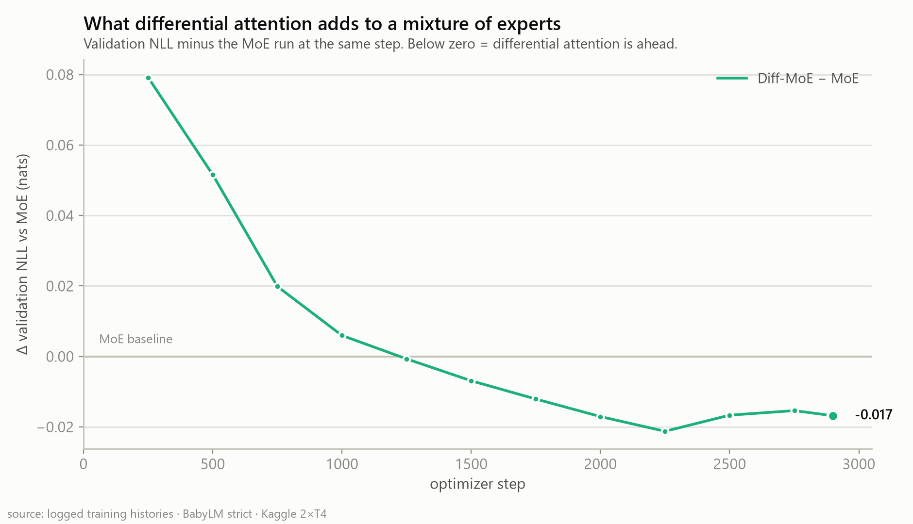

# Part 1 — The plan, and the first head-to-head: MoE vs Diff-MoE

> **Build log, post 1 of 3.** What this project is trying to find out, how it's set up so the answer means something, and the first real result: a mixture-of-experts transformer and a *differential*-attention mixture-of-experts transformer, trained under identical conditions on a free Kaggle GPU and put side by side. Part 2 takes the other half of the grid — the plain dense baseline and dense + differential attention.

| | |
|---|---|
| **Question** | Does differential attention earn its place in a mixture-of-experts LM — and does it still earn it once you price in the compute? |
| **Corpus** | BabyLM **strict** — 167.5M train / 17.3M val / 16.1M test tokens (cl100k), 6 domains |
| **Models this post** | **MoE** (standard attention + MoE FFN) vs **Diff-MoE** (differential attention + MoE FFN) |
| **Size** | 209M active · 379M raw · 768d × 14 layers · 100k vocab — *identical active budget* |
| **Hardware** | trained on Kaggle 2×T4 · evaluated on one RTX 3060 |

---

## Why bother running four models

Modern language modeling accumulates tricks. Someone publishes a mechanism, shows it winning on a benchmark, and it enters the standard toolbox — usually long before anyone asks the narrower, more falsifiable question: *at a scale I can afford to run four times, does this thing earn its place — alone, and in combination?*

That question needs a grid, not a demo. A single model with every switch flipped on proves nothing, because there's nothing to subtract. So this project is built as a **2×2 ablation**: two attention types crossed with two feed-forward types, everything else held identical.

| Run | Attention | FFN | The question it answers |
|-----|-----------|-----|-------------------------|
| A | standard | dense | the baseline |
| B | differential | dense | does differential attention help *alone*? |
| **C** | **standard** | **MoE top-2** | **does sparsity help *alone*?** |
| **D** | **differential** | **MoE top-2** | **do they compose?** |

**This post is C vs D** — the two mixture-of-experts runs, which are the pair that isolates differential attention *inside* a sparse model. Part 2 is A vs B, the dense pair.

The scale is deliberate. At ~200M active parameters and a fixed ~167M-token corpus, a full run costs a few hours on hardware that costs nothing, which means the grid is affordable and the numbers are *mine* — measured, not cited. Small scale is a microscope, not a compromise. What it can't do is promise the ordering holds at 70B; nothing at this budget can, and I'll say so again at the end rather than pretend otherwise.

---

## The two ideas

### Differential attention: noise-cancelling context

Ordinary self-attention computes one softmax distribution over the sequence and uses it to mix values:

$$\text{Attn}(X) = \text{softmax}\!\left(\frac{QK^\top}{\sqrt{d}}\right)V$$

The trouble is that a softmax never assigns zero. Some fraction of every token's attention always lands on positions irrelevant to it — a low, broadband hiss of misallocated attention that accumulates as context grows.

Differential attention (Ye et al., 2024) borrows the trick behind noise-cancelling headphones: compute **two** attention maps and subtract the second from the first.

$$\text{DiffAttn}(X) = \left(\text{softmax}\frac{Q_1K_1^\top}{\sqrt{d}} \;-\; \lambda \cdot \text{softmax}\frac{Q_2K_2^\top}{\sqrt{d}}\right)V$$

Whatever *noise* the two maps share cancels in the subtraction; whatever they *disagree* on — the signal — survives. The strength of the subtraction is a learned scalar λ, one per layer, kept positive by a re-parameterization and offset by a fixed, depth-increasing initialization so the network starts somewhere sensible and is free to move:

$$\lambda = \exp(\lambda_{q_1}\!\cdot\lambda_{k_1}) - \exp(\lambda_{q_2}\!\cdot\lambda_{k_2}) + \lambda_{\text{init}}, \qquad \lambda_{\text{init}}(\ell) = 0.8 - 0.6\,e^{-0.3\,\ell}$$

If λ were pinned at zero the layer would collapse back to ordinary attention. That it's *learned*, and moves, is what makes the mechanism more than decoration — and it's directly measurable, which we do below.

### Mixture of experts: capacity without the compute bill

A standard transformer spends every one of its feed-forward parameters on every token. Capacity and cost are welded together: to store more, you pay more FLOPs per token, always.

A mixture-of-experts feed-forward breaks the weld. Instead of one feed-forward block per layer it keeps a **bank** of them — the experts — plus a small router that, per token, picks the top two to run:

$$g = \text{softmax}(x\,W_r^\top), \qquad \mathcal{T} = \text{top-}2(g), \qquad y = \sum_{i \in \mathcal{T}} \frac{g_i}{\sum_{j\in\mathcal{T}} g_j}\, E_i(x)$$

The model *stores* the whole bank but only *spends* two experts per token. The famous failure mode is collapse: left alone, the router finds one strong expert, sends everything there, and the rest of the bank withers. Two regularizers prevent it. The load-balance loss pushes routing toward uniform —

$$\mathcal{L}_{\text{aux}} = N \sum_{e=1}^{N} f_e \, P_e$$

— which equals exactly **1.0 per layer under perfectly uniform routing**, so with 12 MoE layers the balanced floor is **12.0**, and any drift upward is a built-in collapse alarm. The router z-loss keeps the raw logits from wandering:

$$\mathcal{L}_{z} = \frac{1}{B}\sum_{t}\left(\log\sum_{e} e^{\ell_{t,e}}\right)^{2}$$

Both ride along with small weights, steering without overriding the language objective:

$$\mathcal{L} = \mathcal{L}_{\text{CE}} + 0.01\,\mathcal{L}_{\text{aux}} + 0.001\,\mathcal{L}_{z}$$

---

## Making the comparison actually mean something

A bigger model beating a smaller one tells you nothing. All the value of a 2×2 sits in what's held constant, so two parity rules are enforced in code and guarded by tests.

**Attention parity.** Differential attention runs *half the heads at double the width*: 6 heads instead of 12, each carrying two (Q, K) sub-components and a double-width V. The projection cost works out to exactly `4·dim²` per layer either way. When the differential run moves, it's the mechanism talking, not a bigger parameter budget.

**Active-parameter parity.** Each expert's hidden width is the dense width divided by `top_k`: `3072 / 2 = 1536`. The two experts the router actually runs sum to *exactly* the dense feed-forward they replace. The MoE stores far more but spends the same per token.

That forces a distinction that runs through everything here:

- **Raw (total) parameters** — every weight in the checkpoint, all experts included. Sets memory, checkpoint size, optimizer state. Both MoE runs: **379M**.
- **Active parameters** — the weights touched for one token: attention + embeddings + norms + router + only the two selected experts. Sets FLOPs per token. Both MoE runs: **209M** (132M of it outside the embedding table).

| Run | Attention | FFN | Raw | Active | Non-embed active |
|---|---|---|---|---|---|
| MoE | standard | 6 experts, top-2 | 379.14M | 209.27M | 132.20M |
| Diff-MoE | differential | 6 experts, top-2 | 379.16M | 209.29M | 132.22M |

The two models differ by **0.02M parameters** — 0.01%, entirely the λ vectors. Everything else about them is the same size. That's the whole point.

And the rest is held identical too. Both runs used byte-identical training configs — same seed (42), same data in the same order, same schedule, same everything:

```
lr 2e-4, cosine to 10% · warmup 60 · AdamW β(0.9, 0.95) · wd 0.1 · clip 1.0
batch 2 × accum 32 × 2 GPUs × seq 512  =  65,536 tokens per optimizer step
2,900 steps = 190M tokens ≈ 1.13 epochs of the corpus · fp16 AMP · DDP on 2×T4
```

---

## The setup

**Data.** The six BabyLM domains — child-directed speech (CHILDES), spoken British English (BNC), literary prose (Gutenberg), film subtitles (OpenSubtitles), simple Wikipedia, and telephone dialogue (Switchboard) — tokenized once with cl100k into a single packed stream of 512-token windows. No padding: every position is a real token. Six genuinely distinct domains is what makes an MoE a *fair* test — there's something real for experts to specialize on.

**Geometry** (reconstructed from the trained checkpoints' own weight shapes, since the runs were tuned at runtime and match no static config file):

```
vocab_size        100352      # cl100k (100,263) padded to a multiple of 128
dim               768
n_layers          14
n_heads           12          # differential attention uses 6, each double width
seq_len           512
ffn               moe
  n_dense_layers  2           # first two layers stay dense for early stability
  n_experts       6
  top_k           2
  expert_inter    1536        # 2 × 1536 = 3072 = dense inter → active parity
```

With a 100k vocabulary the tied embedding table alone is ~77M parameters, so "379M" is a narrower *body* than it sounds — most of a small model's budget is vocabulary. That's the deliberate trade of a frontier tokenizer: fewer tokens per word, so more text per step, paid for in embedding parameters.

**The road here.** The original plan was wider — `dim 896`, 16 layers, **8** experts, ~700M raw. On paper it fits a 16 GB T4. In practice it OOMed on the first backward pass every time, with a stubbornly identical footprint. That's the raw-vs-active distinction made physical: an MoE holds *all* its experts in memory plus their full fp32 AdamW state (~16 bytes/parameter), so 700M raw is ~11 GB gone before a single activation. Two T4s don't help — DDP replicates the whole model on each card.

The fix wasn't a bigger card, it was reading which number drives memory. Cutting the bank from 8 experts to 6 shrinks *raw* while leaving *active* — and therefore the parity — untouched. Trimming the body to 768×14 brought raw to 379M, which fits alongside the 100k-vocab logits. The models here are smaller than the plan's headline figure, on purpose.

---

## Where the project stands

| Run | Attention | FFN | Status | Steps | Best val NLL |
|---|---|---|---|---|---|
| A · Dense | standard | dense | ✅ trained | 2900 / 2900 | 3.640 — *Part 2* |
| B · Diff-Dense | differential | dense | ✅ trained | 2900 / 2900 | 3.610 — *Part 2* |
| **C · MoE** | standard | MoE | ✅ trained | 2900 / 2900 | **3.599** |
| **D · Diff-MoE** | differential | MoE | ✅ trained (rerun) | 2900 / 2900 | **3.582** |

All four are down. This post is the **MoE pair** — C vs D, the two rows with a mixture of experts, which isolate what differential attention does *inside* a sparse model. [Part 2](part2-diff-dense-vs-dense.md) takes the dense pair, A vs B.

A provenance note I carry through this post: Diff-MoE's *first* session died to a Kaggle timeout at step 2500 of 2900. A later rerun — same seed, same config — completed all 2900 steps, tracked the first run's curve within ±0.007 nats at every shared checkpoint, and is the run every figure now shows. The held-out **test** numbers below are now from that completed run as well.

---

## Head to head: MoE vs Diff-MoE

Every number below is a logged value. No transcription, no smoothing.

### Training loss


> **Fig. 1 — Training cross-entropy.** Every logged step, all four cells. They fall the way they should: a steep early drop as the model learns the shape of English, then a long grind. MoE ends at **2.642**, Diff-MoE at **2.644** — a dead heat on the training stream. Falling training loss is necessary, not sufficient — the question is validation.

### Validation, step for step


> **Fig. 2 — Validation NLL, measured every 250 steps on the identical held-out slice.** It falls **monotonically** in all four; none ever turned upward inside this budget. MoE finishes at **3.599**, Diff-MoE at **3.582** — the best validation number in the whole grid.

Endpoints alone can flatter either side, so here's the difference at every step:



> **Fig. 3 — What differential attention adds, step by step.** Validation NLL minus the MoE run at the same step. Differential attention starts as a **handicap** — +0.079 nats behind at step 250 — closes steadily, crosses over around **step 1250**, and ends **0.017 nats ahead** at step 2900.

That crossover is the most interesting thing in this post, and it's mechanically sensible. Differential attention starts life with two costs: λ is at its initialization rather than anywhere useful, so the subtraction is mis-tuned; and the parity rule buys those λs by halving the head count, so early on the model has 6 attention patterns per layer where the MoE run has 12. Both costs are front-loaded, and both amortize. Once λ settles, the noise-cancelling starts paying and the head-count deficit stops mattering.

The honest reading of Fig. 3 is that a run stopped at step 1000 would have concluded differential attention *hurts*, and the full run concludes it helps by a whisker. Neither is wrong; they're the same curve read at different times. This is the strongest argument I have for why short ablations mislead.

### Then you price it

Step-for-step is the right way to isolate a mechanism. It is not what a compute budget buys. All four runs were logged with throughput, and they are not close:

| Run | tok/s (2×T4) | vs Dense | Hours for 2,900 steps |
|---|---|---|---|
| Dense | 6,944 | 1.00× | 7.6 h |
| MoE | 5,250 | 0.76× | 10.1 h |
| Diff-MoE *(first session)* | 3,851 | 0.55× | 13.7 h |
| Diff-MoE *(rerun, healthy session)* | **5,139** | 0.74× | 10.3 h |


> **Fig. 4 — The same runs, priced in GPU-hours.** Re-plotting Fig. 2 against wall-clock instead of steps, using each run's own measured throughput. With the rerun's healthy 5,139 tok/s, Diff-MoE's curve ends **lowest of all four** at ~10.3 h — a verdict that flipped completely between sessions, which is its own lesson (see the correction box above).

Give every run the same 7.6 GPU-hours the dense baseline used:

| Run | tok/s | Steps reached in 7.6 h | Val NLL there |
|---|---|---|---|
| **Diff-MoE** *(rerun)* | 5,139 | 2,146 | **3.620** |
| MoE | 5,250 | 2,193 | 3.636 |
| Dense | 6,944 | 2,900 | 3.640 |

At healthy throughput, Diff-MoE wins this pair on *both* axes — per step and per hour.

> **A correction that took two tries.** The first Diff-MoE session measured 3,851 tok/s — 27% below MoE — and I initially read that as the price of differential attention *as a mechanism*. Part 2's dense pair said no: the identical change cost only 3.9% there. I then blamed memory pressure (the MoE runs sit at ~11.7 GB on a ~14.5 GB T4). Wrong again: the rerun hit **5,139 tok/s at exactly the same 11.7 GB**. The real culprit was the *session* — Kaggle T4s are shared infrastructure, and the first run landed on a contended one. Differential attention's true cost is **2–4% everywhere**. Two lessons for the price of one: a cost measured once is a property of that setup, and a plausible mechanism story ("memory ceiling!") is still just a story until a second measurement tests it.

### Held-out test

Validation guided training, so it can't be the verdict. For that, both best checkpoints get reloaded and run over the **test** split — 3,200 windows spread evenly across all 16.1M tokens, byte-identical windows for every model, fp32, on a single RTX 3060:

| Run | Steps | Test NLL | Perplexity | bits/byte | Top-1 |
|---|---|---|---|---|---|
| Dense *(Part 2's subject, for scale)* | 2900 | 3.052 | 21.15 | 1.131 | 0.462 |
| **MoE** | 2900 | **2.923** | **18.59** | **1.083** | 0.470 |
| Diff-MoE | 2900 | 2.963 | 19.36 | 1.098 | **0.471** |

**On the test set the ranking flips: plain MoE is ahead of Diff-MoE by 0.041 nats** — even though Diff-MoE won on validation. When I first saw this gap it was 0.054, measured against a Diff-MoE checkpoint that had stopped 400 steps early, and I assumed the truncation explained most of it. Finishing the run closed only a quarter of it. So the flip is real, and it needs a better explanation than "it trained less."

The per-domain breakdown gives one, and it is the sharpest result in this post:

| Domain | MoE | Diff-MoE | Diff-MoE − MoE |
|---|---|---|---|
| childes | **1.904** | 2.027 | **+0.123** |
| simple_wiki | 3.569 | **3.547** | −0.022 |
| open_subtitles | 3.503 | **3.493** | −0.010 |
| bnc_spoken | 3.764 | **3.754** | −0.010 |
| switchboard | 2.367 | **2.363** | −0.004 |
| gutenberg | 3.741 | **3.737** | −0.004 |

**Diff-MoE wins five of six domains and still loses overall**, because the one it loses is child-directed speech — 40% of the test split. And the extra 400 steps moved that gap by 0.004, so undertraining is not the story. Differential attention *costs* something on short, repetitive, locally-predictable text. Which, read against everything else in this series, is exactly what it should do: over a three-word context there is no accumulated attention noise to cancel, so all you are left with is the mechanism's overhead — half the attention heads, and a subtraction that trades common-token fluency for rare-token precision.

How solid is a 0.041-nat gap? Because every model saw byte-identical windows, the difference can be measured **per window** and bootstrapped as a paired statistic — which is far tighter than comparing two independent averages:

| Comparison | Δ test NLL | iid 95% CI | domain-clustered 95% CI | windows won |
|---|---|---|---|---|
| MoE − Dense | −0.129 | [−0.134, −0.124] | [−0.142, −0.051] | **96.0%** |
| Diff-MoE − MoE | +0.041 | [+0.037, +0.045] | [**−0.016**, +0.055] | 47.7% |

The iid interval is nowhere near zero — the standard error is 0.002 nats against an effect of 0.041, so the test set measures this ~19× more precisely than the effect size. **Finite test data is not what limits any claim in this post.**

But the second interval is the one that should govern how hard you push this result. Resampling *windows* assumes windows are interchangeable draws; they aren't, because they come in six domains that differ by two nats. Resample the **domains** instead and the Diff-MoE deficit **crosses zero** — [−0.016, +0.055]. That is not a contradiction, it is the honest statement of what the gap is: a fact about this corpus mixture, driven by one domain, rather than an architecture-level verdict that would survive reweighting the six domains. MoE-over-dense, by contrast, clears zero under both resampling schemes.

That last column is worth pausing on. MoE beats dense on **96% of individual windows** — a broad shift of the whole distribution, not a few lucky passages. Diff-MoE against MoE wins **47.7%** of windows: a coin flip, with the mean pulled positive by a minority of windows where it loses badly. Those two numbers describe completely different situations, and only the paired evaluation can tell them apart.

Which is why *where* the difference sits matters more than its size:


> **Fig. 5 — The six domains are not equally hard.** Child-directed speech (CHILDES) and telephone dialogue (Switchboard) are less than half as surprising as literary prose or adult spoken English. Identical windows for every model.

There's a second, more useful lesson buried in the per-domain numbers. Compare MoE against the dense baseline on validation and on test:

| | Validation (BNC only) | Test (all six domains) |
|---|---|---|
| MoE − Dense | −0.042 nats | **−0.129 nats** |

The advantage is **three times larger** on the real test set than the validation curve suggested — because training-time validation reads the first 51,200 tokens of `val.bin`, and that region is entirely BNC spoken English, which happens to be the domain where MoE helps *least* (−0.044). I had been watching the one slice that most understated the effect I was trying to measure. The comparison was never unfair — all four runs read identical windows — but for eight hours per run it was quietly answering a narrower question than I thought I was asking.

### The experts didn't collapse — in either run

The classic MoE failure is one hot expert and a dead bank. It didn't happen. The load-balance loss sits at **12.05** against a theoretical floor of 12.0 (1.0 per layer × 12 MoE layers) from the first hundred steps onward, and the direct measurement on held-out data agrees:

| Run | Routing entropy (min / mean) | Load imbalance (max) |
|---|---|---|
| MoE | 0.9996 / 0.9999 | 1.066 |
| Diff-MoE | 0.9994 / 0.9998 | 1.101 |

Normalized entropy of 1.0 is a perfectly even split across all six experts; 0 is total collapse. Every MoE layer in both models sits above 0.999. The whole bank is in use, and differential attention doesn't destabilize the router — the two mechanisms coexist without interfering.

But balanced routing sharpens a better question. Six domains, six experts — did the router learn to send literary prose to one and toddler speech to another? Measuring routing distributions per domain, the answer is a flat no: the largest deviation from uniform (total-variation distance) across all 12 MoE layers is **0.052** for MoE and **0.044** for Diff-MoE, where 0 means no preference at all and 1 means total specialization. Every domain spreads its tokens almost perfectly evenly over the whole bank.

The load-balance loss did its job a little too well. The exact pressure that keeps entropy pinned at 1.0 also forces every domain to spread evenly. Balance and specialization pull against each other, and here balance won outright — in both models. The knob is right there: `aux_loss_coef = 0.01` sets the trade directly, and annealing it down late in training is a one-line experiment I haven't run yet.

### Differential attention is live at every layer

If the mechanism were inert, λ would sit exactly on its depth-increasing initialization. It doesn't:

| layer | 0 | 1 | 2 | 3 | 4 | 5 | 6 | 7 | 8 | 9 | 10 | 11 | 12 | 13 |
|---|---|---|---|---|---|---|---|---|---|---|---|---|---|---|
| **init** | 0.20 | 0.36 | 0.47 | 0.56 | 0.62 | 0.67 | 0.70 | 0.73 | 0.75 | 0.76 | 0.77 | 0.78 | 0.78 | 0.79 |
| **learned** | 0.16 | 0.43 | 0.67 | 0.59 | 0.62 | 0.65 | 0.70 | 0.74 | 0.81 | 0.75 | 0.83 | 0.84 | 0.74 | 0.77 |

The model moved λ at **every** layer. Deeper layers settle around 0.81–0.84 — subtract *harder* — while layer 0 drops *below* its initialization to 0.16, learning to subtract *less* where the residual stream is still raw. That's per-layer tuning, not a decoration sitting at its defaults. Whatever else Fig. 3 and Fig. 4 say about whether it's worth the money, the mechanism is genuinely doing something.

---

## What I'd say so far

**Sparsity earns its place.** A mixture of experts beat the dense baseline by **0.042 nats at every single checkpoint**, and by **0.129 nats on the full test split** — in all six domains. It costs 24% throughput and 1.8× the checkpoint size, and at identical *active* compute it still comes out ahead on steps, on hours, and on final test. That's the cleanest signal in the grid.

One honesty note on how to read "at every checkpoint": those twelve points sit on a single trajectory from a single seed, so they're autocorrelated. Their tight spread means the gap is *persistent* — it isn't within-run measurement noise — but it is **not** an error bar, and I originally wrote it in a way that implied one. Whether seed 43 reproduces it is a question I have not asked.

**Differential attention is genuinely ambiguous here.** It's alive, it's tuned per layer, and step-for-step on validation it's ahead of plain MoE from step 1250 on — by 0.017 nats at 2900, which is less than half the MoE-over-dense effect, and I have no run-to-run noise estimate to compare it against, which is caveat number one below. On the held-out test set it's 0.041 nats *behind*, and the completed run showed that gap is one domain rather than one missing epoch. Depending on which axis you privilege — steps, hours, or final test — differential attention *in a mixture of experts* is a small win, a clear loss, or a loss with an alibi. That is not a result you can round into a headline, and the fix is more runs, not better prose.

The narrower claim I'll defend: **the two mechanisms don't stack well, and now I can say why.** Part 2 measures the interaction directly — stacking recovers ~82% of the parts on validation but only **56% on test**, and essentially the whole shortfall is CHILDES, a domain the validation slice never contains.

**The caveats, stated rather than buried:**

- **Single seed.** Every run is `seed=42`, once. I have no variance bar, so a 0.017-nat difference is suggestive, not established. The 0.042-nat MoE effect is large and consistent enough across twelve checkpoints that I believe it; the differential effect is exactly in the range where seed noise could explain it. Re-running one pair with a second seed is the single highest-value experiment left.
- **Diff-MoE took two sessions.** The first crashed at 2500/2900; the rerun completed all 2,900 steps and is what every number and figure here reports. The two sessions tracked each other within ±0.007 nats at every shared checkpoint, so the rerun is a continuation of the same result rather than a second draw — it is *not* a seed replicate and does nothing to close the variance gap below.
- **The validation slice is narrower than it sounds.** Training-time validation reads the first 51,200 tokens of `val.bin`, and that region is entirely **BNC spoken English**. All four runs saw identical windows, so the comparison is sound, but "val NLL 3.599" means *on adult British speech*, not on BabyLM as a whole. The test numbers above use the full six-domain split and are the ones to quote.
- **Undertrained on purpose.** ~190M tokens against 209M active parameters is roughly 1 token per parameter — about 15× below the Chinchilla-optimal ratio. That's on-topic for BabyLM, whose entire premise is a small fixed corpus, but it means these models are nowhere near their own ceilings. Validation never turned upward in any run; there was more to learn when the budget ran out.
- **~200M active parameters is not 70B.** Everything here is a statement about this scale.

---

## Next: Part 2

The other half of the grid — Run A (dense) against Run B (differential attention with a dense feed-forward). That pair answers whether differential attention helps *on its own*, with no mixture of experts underneath it.

Before those runs finished, Fig. 3 let me write down a falsifiable prediction, so here it is on the record: if the crossover really is λ needing time to settle, the dense pair should show the **same shape** — differential behind early, crossing over somewhere in the middle third. If instead Diff-Dense were ahead from step one, then what we saw here wasn't λ warming up, it was differential attention fighting the router.

[**Part 2 — Does differential attention help on its own?**](part2-diff-dense-vs-dense.md) settles that, and two other things this post left open: whether the 27% throughput bill above is really the mechanism's price, and whether stacking the two ideas delivers the sum of what each delivers alone.

[**Part 3 — What we measured, why those metrics, and what they'd mean in production**](part3-what-we-measured-and-why.md) steps back from the results to the instrument: the six evaluation passes behind every number in this series, and what each one would actually tell you if you were shipping the model.

Both predictions held. One of the verdicts in this post did not.

---

*Differential-MoE build log · differential attention: Ye et al., 2024 · MoE routing after Switch/GShard · trained on the [BabyLM Challenge](https://babylm.github.io/) corpus · training metrics logged to Weights & Biases; figures reproducible via `docs/blog/make_figures_part1.py`, checkpoint evaluation via `scripts/eval_all.py`.*
