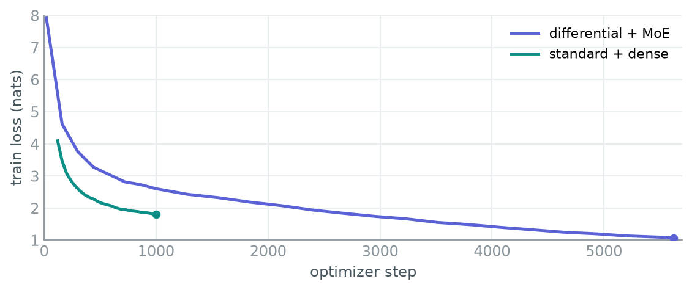
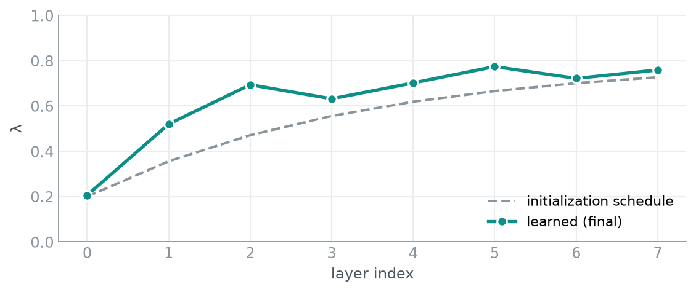
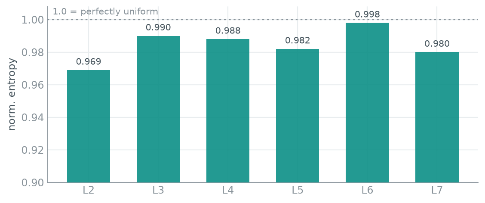
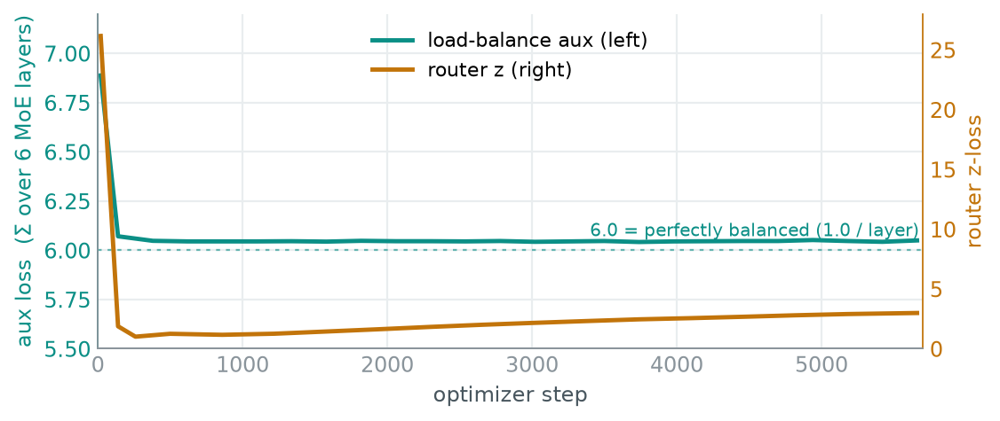
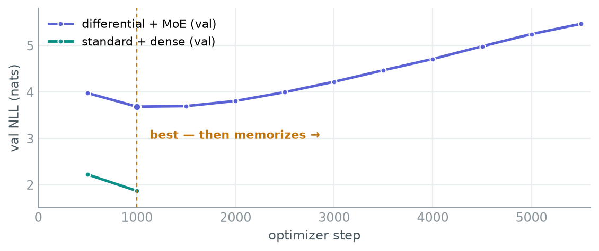

# Differential-MoE, Part 1 — First Light from the Miniature

> **Build log · Part 1 of 2**
> Does differential attention help a Mixture-of-Experts language model — and does it still help once you stack the two? Before spending real compute, I built the smallest honest version of the experiment and turned it on.

| | |
|---|---|
| **Project** | Differential-MoE |
| **Stage** | miniature / instrument check |
| **Hardware** | Kaggle 2×T4 |
| **Data** | BabyLM strict-small (~13M tokens) |
| **Model** | 15.7M active params · 4,096 vocab · 8 layers |

---

## The question

Modern language models borrow tricks constantly, and papers tend to arrive with the trick already declared a winner. This project takes two of them and asks a narrower, more falsifiable question: at a scale small enough to run for the cost of electricity, does each one actually earn its place — alone, and together?

The honest way to answer that is a controlled comparison, not a single big model with everything switched on. So the whole project is built around a **2×2 grid**: standard attention vs. differential attention, crossed with a dense feed-forward vs. a Mixture-of-Experts feed-forward. Four models, everything else held identical — same tokenizer, same data in the same order, same schedule, same seed.

**Idea 01 — Differential attention.** Standard attention computes one softmax map over the sequence, and some of its weight lands on irrelevant tokens — call it attention noise. Differential attention computes *two* maps and subtracts one from the other, so shared noise cancels and the signal is what survives. Noise-cancelling headphones for context.

**Idea 02 — Mixture of Experts.** Instead of one feed-forward block per layer, keep a bank of them — the *experts* — and a small router that sends each token to just two. The model holds far more parameters than it spends on any single token, so capacity grows without the compute-per-token growing with it.

---

## The discipline: the comparison is only worth anything if it's fair

A bigger model beating a smaller one tells you nothing. The entire value of this experiment is in what's held constant, so two rules are enforced in code and checked by tests:

- **Attention parity.** Differential attention uses half the heads at double the width, so both attention variants cost exactly the same parameters per layer — the difference is the mechanism, not the budget.
- **Active-parameter parity.** Each expert is sized so the two the router picks add up to exactly the dense feed-forward. The MoE model stores more, but spends the same per token. Every comparison is equal-compute by construction.

And because the tokenizer is deliberately tiny, every result is also reported in **bits-per-byte** — a measure that doesn't care which tokenizer you used, so the numbers stay honest when the scaled-up run switches to a bigger vocabulary.

---

## The mechanisms, in equations

Two ideas, four short pieces of math. Everything the charts later show is one of these terms being watched.

### Differential attention

Ordinary attention is a single softmax over the sequence:

$$\text{Attn}(X) = \text{softmax}\!\left(\frac{QK^\top}{\sqrt{d}}\right)V$$

That single map is where the noise lives — probability mass leaks onto tokens that don't matter. Differential attention splits the queries and keys into two halves, $Q=[Q_1;Q_2]$ and $K=[K_1;K_2]$, forms **two** maps, and subtracts the second from the first:

$$\text{DiffAttn}(X) = \left(\text{softmax}\frac{Q_1K_1^\top}{\sqrt{d}} \;-\; \lambda \cdot \text{softmax}\frac{Q_2K_2^\top}{\sqrt{d}}\right)V$$

Whatever noise both maps share cancels in the subtraction; what survives is the part they disagree on — the signal. The strength of the subtraction is a **learnable scalar $\lambda$, one per layer**, kept positive through a re-parameterization and offset by a fixed initialization:

$$\lambda = \exp(\lambda_{q_1}\!\cdot\lambda_{k_1}) - \exp(\lambda_{q_2}\!\cdot\lambda_{k_2}) + \lambda_{\text{init}}, \qquad \lambda_{\text{init}}(\ell) = 0.8 - 0.6\,e^{-0.3\,\ell}$$

That $\lambda_{\text{init}}$ schedule is the dashed line in Fig. 02 — the model starts there and is free to move. The head output is then RMS-normalized and scaled by $(1-\lambda_{\text{init}})$ to keep the residual stream's magnitude stable.

### Mixture of Experts, and the two losses that keep it honest

The router scores every expert, keeps the top two, and renormalizes their gate weights:

$$g = \text{softmax}(x\,W_r^\top), \qquad \mathcal{T} = \text{top-}2(g), \qquad y = \sum_{i \in \mathcal{T}} \frac{g_i}{\sum_{j\in\mathcal{T}} g_j}\, E_i(x)$$

Left alone, that router collapses — it finds one good expert and starves the rest. Two auxiliary losses prevent it. The **load-balance loss** pushes the router toward using every expert equally, where $f_e$ is the fraction of tokens sent to expert $e$ and $P_e$ its mean gate probability:

$$\mathcal{L}_{\text{aux}} = N \sum_{e=1}^{N} f_e \, P_e$$

It equals exactly **1.0 per layer under perfectly uniform routing**, and grows as routing skews. The **router z-loss** keeps the raw logits from exploding, which stabilizes the softmax:

$$\mathcal{L}_{z} = \frac{1}{B}\sum_{t=1}^{B}\left(\log\sum_{e} e^{\ell_{t,e}}\right)^{2}$$

Both are added to the cross-entropy with small weights, so they steer without overriding the actual language objective:

$$\mathcal{L} = \mathcal{L}_{\text{CE}} + \alpha\,\mathcal{L}_{\text{aux}} + \beta\,\mathcal{L}_{z}, \qquad \alpha = 0.01,\ \ \beta = 0.001$$

Keep those four expressions in mind — $\lambda$, $f_e$, $\mathcal{L}_{\text{aux}}$, $\mathcal{L}_{z}$. The rest of this post is mostly watching them move.

---

## First light: 15.7M parameters on a laptop-sized corpus

Before committing a week of GPU quota to a 300M-parameter run, the point of the miniature is unglamorous: prove every wire is connected. Does the model train? Does distributed training work? Do the two mechanisms actually do what the papers say — and does the instrumentation catch it when they don't?

The miniature is ~15.7M active parameters, an 8-layer decoder with a 4,096-token vocabulary trained on [BabyLM](https://babylm.github.io/) strict-small — about 13 million tokens of child-directed speech, dialogue, and simple prose. It ran on two Kaggle T4s. Here is what came back.

### The pipeline runs — and runs fast

Both configurations trained cleanly across two GPUs, the baseline at **108,000 tokens per second**, using under a gigabyte of the 16 GB each card offers. Training loss falls the way it should.

> **Fig. 01 — Training loss.** Cross-entropy in nats vs. optimizer step, both runs. Baseline falls 4.09 → 1.80 over its 1,000 steps before the Kaggle session ended; differential+MoE falls 7.91 → 1.07 across 5,600+ steps. Falling training loss is necessary, not sufficient — the story is where *validation* goes.

---

## Both ideas are demonstrably doing their job

A training loss that goes down doesn't prove differential attention is *differencing* or that the experts are *specializing*. Those need their own instruments — and both read clean.

### Differential attention learns a per-layer balance

The subtraction is scaled by a learnable value, λ, one per layer, initialized on a gentle schedule that grows with depth. If the mechanism were inert, λ would sit where it started. It doesn't:

| Layer | 0 | 1 | 2 | 3 | 4 | 5 | 6 | 7 |
|---|---|---|---|---|---|---|---|---|
| **init** | 0.20 | 0.36 | 0.47 | 0.56 | 0.62 | 0.67 | 0.70 | 0.73 |
| **learned** | 0.21 | 0.52 | 0.69 | 0.63 | 0.70 | 0.77 | 0.72 | 0.76 |

> **Fig. 02 — Learned λ by depth vs. initialization.** The model didn't keep its initialization — it moved every layer while preserving the increasing-with-depth shape, strongest in the middle stack. Concrete evidence the differential mechanism is live and being tuned, not decorative.

### The experts stay balanced — no collapse

The classic failure of Mixture-of-Experts is collapse: the router discovers one expert, sends everything there, and the rest atrophy. The original version of this repository had no defense against it. The rebuild adds a load-balancing loss, and the routing entropy confirms it works:

| MoE layer | L2 | L3 | L4 | L5 | L6 | L7 |
|---|---|---|---|---|---|---|
| **norm. entropy** | 0.969 | 0.990 | 0.988 | 0.982 | 0.998 | 0.980 |

> **Fig. 03 — Routing entropy per MoE layer.** Normalized entropy of the expert assignment over validation, layers 2–7 (first two layers dense). Every value sits between 0.97 and 1.00, where 1.0 is a perfectly even split across all eight experts. The load-balancing loss holds; nothing collapsed.

### The two auxiliary losses, doing exactly their jobs

That balanced routing isn't luck — it's $\mathcal{L}_{\text{aux}}$ and $\mathcal{L}_{z}$ from the equations above, working in the background. Watching them directly is the cleanest confirmation the regularizers are live:

> **Fig. 05 — Auxiliary losses over training.** Left axis: the load-balance loss, summed over all six MoE layers. It drops to **6.0 within the first hundred steps and stays there** — that's exactly 1.0 per layer, the value of perfectly uniform routing, which is why the entropy in Fig. 03 is pinned near the ceiling. Right axis: the router z-loss falls off a cliff from 26 to ~1 as the initially wild logits get tamed, then drifts slowly back up.

Two things worth reading off this chart. First, the load-balance loss reaching its theoretical floor and *staying* there is the strongest possible statement that no expert is being starved — the mechanism the original repo lacked entirely. Second, that slow upward drift in the z-loss after step ~300 is not noise: it's the router's logits growing sharper and more confident as training continues — the same over-confidence that, on this tiny corpus, is the model beginning to memorize. Hold that thought.

---

## The finding: the instrument caught something — the model memorized

Here is where the miniature earned its keep. The differential+MoE run's training loss kept dropping beautifully, all the way to a perplexity under 3. Its validation loss did the opposite.

| Step | 500 | 1000 | 1500 | 2000 | 2500 | 3000 | 3500 | 4000 | 4500 | 5000 | 5500 |
|---|---|---|---|---|---|---|---|---|---|---|---|
| **val NLL** | 3.98 | **3.68** | 3.69 | 3.81 | 4.00 | 4.22 | 4.47 | 4.71 | 4.98 | 5.25 | 5.46 |

Validation reached its best point early, around step 1,000, and then climbed — steadily, for another 4,500 steps — while training loss kept falling to 1.07. That gap is the signature of a model memorizing its training set rather than learning the language. On a 13-million-token corpus, a schedule of 7,000 steps is roughly **70 passes over the same data**. Far too many.

> **Fig. 04 — Validation NLL, the overfit in one picture.** The differential+MoE run bottoms out near step 1,000, then rises for the rest of the run — its usable checkpoint is that early minimum, not the final state. The baseline was still descending when its session was cut off.

**Why this is a good outcome for a Part 1.** The miniature was never meant to answer "does differential attention win." It was meant to prove the experiment is trustworthy — and it did, by flagging its own broken run instead of quietly reporting a memorized training score as success. The over-epoching here is the exact failure the scaled-up run is now built to avoid: a throughput probe measures real tokens-per-second and sets the step budget from the corpus size, not from a habit.

---

## How the pieces line up

The five charts aren't five separate observations — they're the four quantities from the equations, watched over the same run. Read together they tell one coherent story:

| Equation term | What it should do | Where you see it | Verdict |
|---|---|---|---|
| $\lambda$ per layer | move off its init, keep the depth shape | Fig. 02 | ✅ learned, depth-increasing |
| $f_e$ (routing fractions) | stay uniform across experts | Fig. 03 entropy ≈ 1.0 | ✅ balanced |
| $\mathcal{L}_{\text{aux}}$ | sit at 1.0 / layer (6.0 total) | Fig. 05 left axis | ✅ pinned at the floor |
| $\mathcal{L}_{z}$ | tame the logits, then track confidence | Fig. 05 right axis | ✅ 26→1, then rises with overfit |
| $\mathcal{L}_{\text{CE}}$ | fall on train, bottom-then-rise on val | Figs. 01 & 04 | ⚠️ trains fine, **overfits** |

The two auxiliary losses are small by design ($\alpha, \beta \ll 1$), so they shape the model without distorting the language objective — which is exactly why the training-loss curve in Fig. 01 is smooth rather than fighting three objectives at once. And the one genuinely diagnostic correlation is the last two rows read together: as the model runs out of new things to learn from 13M tokens and starts memorizing, the router grows over-confident ($\mathcal{L}_z$ creeps up) at the same time validation turns ($\mathcal{L}_{\text{CE}}$ diverges). Same underlying cause, visible in two independent instruments. That's the difference between a dashboard and a diagnosis.

---

## Reading the runs honestly: what these two are — and aren't

It would be easy, and wrong, to put the baseline's 1.87 next to the differential+MoE's final 5.46 and declare a winner. One run stopped early; the other ran long enough to overfit. They saw different amounts of data. This is a status report on the instrument, not a verdict on the architecture.

| Run | State | Best val NLL | Best val PPL | Tokens seen | Reading |
|---|---|---|---|---|---|
| standard + dense | cut short | 1.87 | 6.46 | 131M | Healthy, still improving at cutoff |
| differential + MoE | overfit | 3.68 | 39.7 | 742M | Best at step ~1,000, memorized after |

**Verified working:** DDP across 2×T4 · fp16 + grad-scaler · checkpoint/resume · per-layer λ logging · expert entropy & imbalance · aux + router-z loss · bits-per-byte · held-out test split.

---

## Next — Part 2: scaling up, with the budget set by the corpus

Part 2 runs the same 2×2, but grown: ~295M active parameters, a frontier cl100k tokenizer in place of the tiny custom one, and the full BabyLM *strict* track — 168 million tokens, measured, not estimated. This time the step count comes from a throughput probe rather than a guess, so no run over-epochs itself into memorizing. That's when the four models finally become comparable — and when the actual question gets an answer.

---

*Differential-MoE — build log · Part 1 · the miniature · metrics logged to Weights & Biases · differential attention: Ye et al. 2024 · [BabyLM Challenge](https://babylm.github.io/)*
