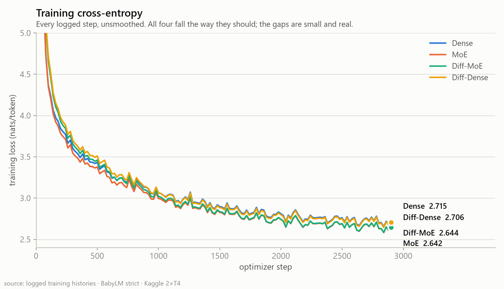
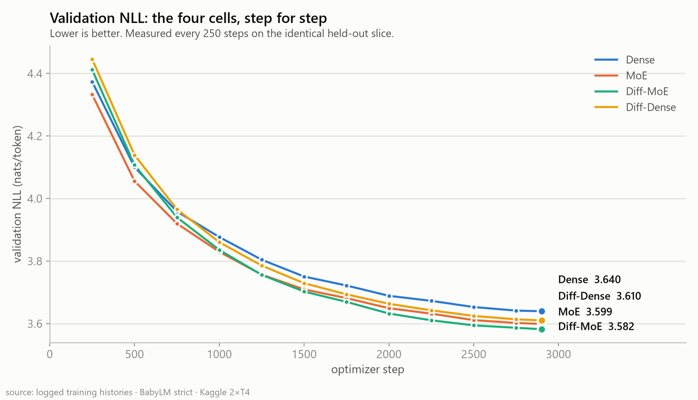
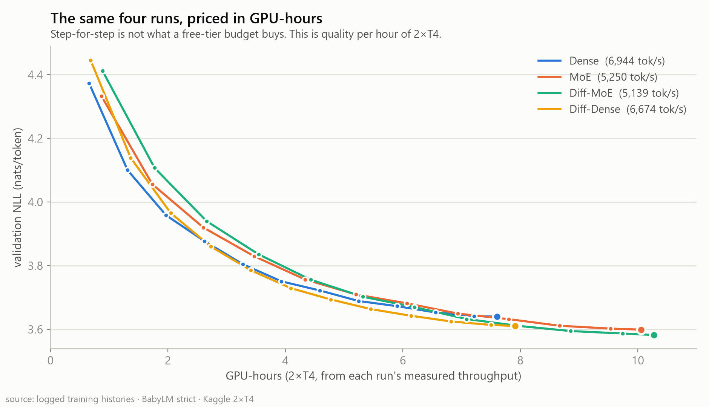
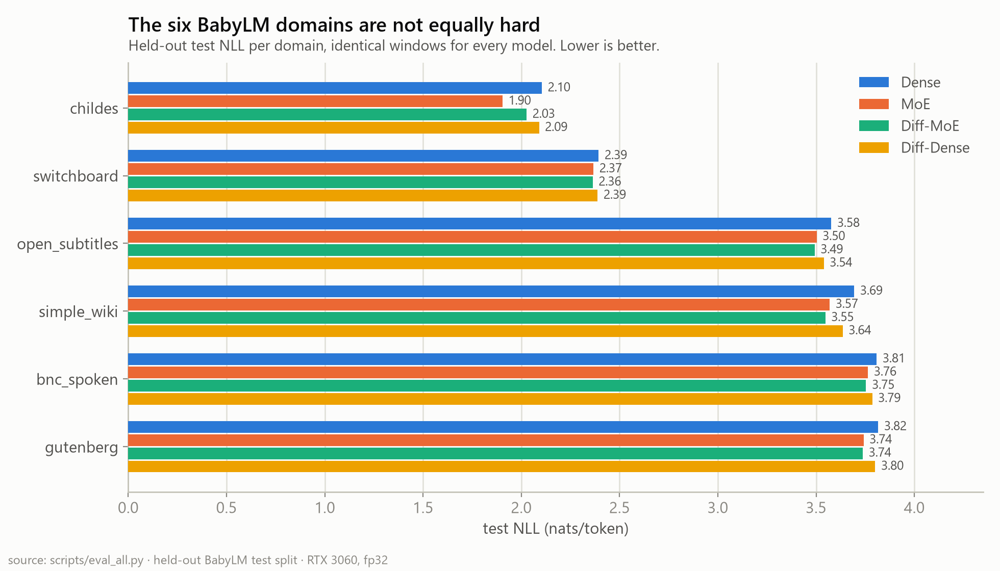

# Part 2 — Does differential attention help on its own?

> **Build log, post 2 of 3.** [Part 1](part1-plan-and-moe-vs-diffmoe.md) laid out the project and ran differential attention *inside* a mixture of experts, where it looked expensive and ambiguous. This post runs it on its own — differential attention against ordinary attention, with a plain dense feed-forward underneath both. It's the cleaner experiment, it produces a clearer answer, and it overturns the cost verdict I reached in Part 1.

| | |
|---|---|
| **Question** | Does differential attention earn its place with no mixture of experts involved? |
| **Models** | **Dense** (standard attention) vs **Diff-Dense** (differential attention) |
| **Size** | 209.21M vs 209.24M parameters — a 0.01% difference, entirely the λ vectors |
| **Corpus** | BabyLM *strict*, 190M tokens each, identical data order, `seed 42` |
| **Answer** | **Yes — and unlike in the MoE pair, it's nearly free** |

---

## Why this pair is the one that matters

The 2×2 has four cells. Part 1 ran the bottom row — both models had a mixture of experts, so any difference between them was differential attention *plus* whatever it does to a router. This post runs the top row:

| Run | Attention | FFN | |
|-----|-----------|-----|---|
| **A · Dense** | standard | dense | ← this post |
| **B · Diff-Dense** | differential | dense | ← this post |
| C · MoE | standard | MoE top-2 | *Part 1* |
| D · Diff-MoE | differential | MoE top-2 | *Part 1* |

Two models, one difference, nothing else moving. Same seed, same data in the same order, same schedule, same token budget, same everything. **The only thing that changed is how attention computes.**

---

## The math, slowly

Part 1 gave these equations in passing. Since this post is entirely about the mechanism, they're worth doing properly.

### Ordinary attention, and the problem with softmax

A standard attention head projects the input into queries, keys, and values, scores every position against every other, and normalizes with a softmax:

$$\text{Attn}(X) = \text{softmax}\!\left(\frac{QK^\top}{\sqrt{d}}\right)V$$

The softmax is what makes this work and also what limits it. For a row of scores $s_1 \dots s_n$:

$$\text{softmax}(s)_i = \frac{e^{s_i}}{\sum_{j} e^{s_j}}$$

Because $e^{x} > 0$ for every real $x$, **every output is strictly positive**. There is no score, however low, that produces exactly zero attention. If a token genuinely should ignore 500 of the 512 positions in its context, it cannot — the best it can do is give each a small weight. Those small weights are not free: they multiply real value vectors and sum into the output. The result is a low, broadband hiss of attention mass landing where it shouldn't, and it grows with context length, because there are simply more irrelevant positions to leak onto.

### The differential trick

Differential attention (Ye et al., 2024) borrows the idea behind noise-cancelling headphones. A headphone can't remove noise from a signal it only measures once — but with *two* microphones it can subtract, and whatever both picked up cancels while whatever only one heard survives.

So: compute two attention maps and subtract the second from the first.

$$\text{DiffAttn}(X) = \Big(\underbrace{\text{softmax}\tfrac{Q_1K_1^\top}{\sqrt{d}}}_{\text{signal + noise}} - \lambda \cdot \underbrace{\text{softmax}\tfrac{Q_2K_2^\top}{\sqrt{d}}}_{\text{mostly noise}}\Big)V$$

The two maps are computed from *different* projections of the same input, so they agree about the broad, content-independent background and disagree about what actually matters. Subtract, and the common part — the hiss — cancels.

Note what this buys that a single softmax cannot: **the bracket can now be negative or exactly zero.** The mechanism can genuinely switch a position off, or actively push it away. That is a strictly larger space of behaviours than any single softmax can express, and it costs one scalar per layer.

### λ, and why it has that peculiar form

How hard should the subtraction be? Too little and nothing cancels; too much and you delete the signal along with the noise. That strength is λ, and it's learned:

$$\lambda = \exp(\lambda_{q_1}\!\cdot\lambda_{k_1}) - \exp(\lambda_{q_2}\!\cdot\lambda_{k_2}) + \lambda_{\text{init}}$$

The two exponentials look baroque but they're doing something simple: $\exp$ is always positive and smooth, so the learned part is a difference of two positive numbers — free to move either direction, with well-behaved gradients, and never blowing up the way a raw unconstrained scalar can. It's re-parameterization for optimizer stability, nothing deeper.

The offset is the interesting part:

$$\lambda_{\text{init}}(\ell) = 0.8 - 0.6\,e^{-0.3\,\ell}$$

At layer 0 this is 0.20; by layer 13 it's 0.79. **Deeper layers start out subtracting harder.** The intuition is that early layers still work with fairly raw token identity, where aggressive cancellation would destroy information, while deep layers manipulate abstract representations where noise is more of a liability. That's the paper's prior, baked into initialization. Whether the model *keeps* it is measurable, and we measure it below.

### The parity rule — and the confound it carries

If the differential model simply had more parameters, any win would be meaningless. So attention parity is enforced: the differential variant uses **half the heads at double the width**. A standard layer's projections cost $4d^2$; the differential layer's, with $n/2$ heads each twice as wide, also cost $4d^2$.

$$209{,}236{,}480 \ \text{vs}\ 209{,}213{,}184 \ \text{parameters} \quad (+0.011\%)$$

That 23K difference is the λ vectors themselves. As parameter matching goes, this is about as tight as it gets.

But parity has a price worth stating plainly: **this design confounds two changes.** Diff-Dense has the subtraction *and* it has 6 attention heads where Dense has 12. If it loses early, is that λ warming up, or is it having half as many independent attention patterns? The experiment as built can't separate them — and I'll come back to this.

---

## Results

Every number below is a logged value or a reload of the final checkpoint. No smoothing, no transcription.

### Training loss

> **Fig. 1 — Training cross-entropy, every logged step.** Dense ends at **2.715**, Diff-Dense at **2.706**. A 0.009-nat gap in training loss is nearly nothing — which is the first hint that whatever differential attention is doing here, it shows up more in generalization than in fitting the training stream.

### Validation: behind, then ahead

> **Fig. 2 — Validation NLL, every 250 steps on the identical held-out slice.** Dense finishes at **3.640**, Diff-Dense at **3.610**. Neither ever turned upward — no overfitting inside this budget.

The endpoints hide the interesting part. Here is the gap at every step:

| Step | Dense | Diff-Dense | Δ |
|---|---|---|---|
| 250 | 4.3735 | 4.4457 | **+0.0722** |
| 500 | 4.1003 | 4.1390 | +0.0387 |
| 750 | 3.9585 | 3.9655 | +0.0070 |
| **1000** | 3.8768 | 3.8604 | **−0.0164** ← crossover |
| 1500 | 3.7506 | 3.7292 | −0.0214 |
| 2000 | 3.6890 | 3.6635 | −0.0255 |
| 2500 | 3.6531 | 3.6247 | −0.0284 |
| 2900 | 3.6397 | 3.6103 | **−0.0293** |

**Differential attention starts as a handicap — 0.072 nats behind — and crosses over near step 1000.** Then the gap widens steadily and is still widening when the budget runs out.

This is exactly the shape Part 1 predicted, in writing, before these runs existed. The prediction was: *if the crossover in the MoE pair is λ needing time to settle, the dense pair should show the same shape; if instead Diff-Dense is ahead from step one, then what we saw was differential attention fighting the router.*

| Comparison | Δ at step 250 |
|---|---|
| Diff-MoE − MoE (with a router beneath) | +0.079 |
| Diff-Dense − Dense (no router) | **+0.072** |

Near-identical. **The early penalty is intrinsic to the mechanism, not a conflict with expert routing.** λ starts at its initialization and has to be learned; the head count is halved from the first step. Both costs are front-loaded and both amortize.

There's a lesson in that table that has nothing to do with attention: **a run stopped at step 750 would have concluded differential attention hurts.** Same curve, read too early. Short ablations don't just add noise — they can invert your answer.

### What λ actually learned

If the mechanism were inert, λ would sit exactly on its initialization schedule. It doesn't:

| layer | 0 | 1 | 2 | 3 | 4 | 5 | 6 | 7 | 8 | 9 | 10 | 11 | 12 | 13 |
|---|---|---|---|---|---|---|---|---|---|---|---|---|---|---|
| **init** | 0.20 | 0.36 | 0.47 | 0.56 | 0.62 | 0.67 | 0.70 | 0.73 | 0.75 | 0.76 | 0.77 | 0.78 | 0.78 | 0.79 |
| **learned** | **0.11** | 0.54 | 0.57 | 0.59 | 0.69 | 0.77 | 0.74 | 0.70 | 0.77 | 0.78 | 0.72 | 0.75 | 0.79 | 0.74 |

Two things stand out. The model **kept the broad increasing-with-depth shape** — the paper's prior was a good one. And it **pushed layer 0 down to 0.11, nearly half its initialization**, the largest move of any layer. The first attention layer decided it wanted materially *less* cancellation than the schedule offered, which fits the intuition above: at layer 0 the residual stream is still close to raw token identity, and aggressive subtraction there destroys more than it cleans.

Now the part I find genuinely striking. Here is λ from this run against λ from Part 1's Diff-MoE run — two different models, one with six experts under every attention block and one with a plain feed-forward:

| | mean λ | layer-0 λ | correlation across the 14 layers |
|---|---|---|---|
| Diff-Dense | 0.662 | 0.110 | — |
| Diff-MoE | 0.664 | 0.160 | **r = 0.91** |

**The two runs converged on nearly the same λ profile.** Whatever differential attention settles into is a property of *depth and the attention problem itself*, not of what feed-forward sits underneath. That's independent corroboration for the "intrinsic, not interference" conclusion — arrived at from the weights rather than from the loss curves.

### The cost: this is where Part 1 was wrong

Part 1 measured differential attention costing **27% throughput** and concluded it doesn't pay for itself. That conclusion was based on one arm, and this run shows the arm was the problem.

| Identical architectural change | Throughput | Cost |
|---|---|---|
| Dense → Diff-Dense | 6,944 → 6,674 tok/s | **−3.9%** |
| MoE → Diff-MoE *(first session)* | 5,250 → 3,851 tok/s | −26.7% |
| MoE → Diff-MoE *(rerun, healthy session)* | 5,250 → **5,139** tok/s | **−2.1%** |

When first written, this section had only the top two rows, and the 5.2× discrepancy looked like it might be memory pressure — the MoE runs sit at 11.7 GB on a ~14.5 GB T4 while the dense pair breathes at 7.2 GB. **A full rerun settled it**: same config, same 11.7 GB, and the throughput came back at 5,139 tok/s. The first session simply ran on contended shared hardware. So the memory story, plausible as it sounded, was wrong — and differential attention's real cost is **2–4% regardless of what it's attached to**.

At 3.9%, the arithmetic changes completely:

> **Fig. 3 — The four runs priced in GPU-hours** rather than steps, using each run's own measured throughput. Diff-Dense (yellow) is the lowest curve at essentially every hour.

| In the dense run's 7.6 GPU-h | Steps reached | Val NLL |
|---|---|---|
| **Diff-Dense** | 2,788 | **3.613** |
| Diff-MoE *(rerun)* | 2,146 | 3.620 |
| MoE | 2,193 | 3.636 |
| Dense | 2,900 | 3.640 |

**Diff-Dense is the best use of a fixed GPU-hour budget of all four cells — and with the rerun's healthy throughput, both differential models now beat both standard-attention models on a time budget.** Differential attention wins per step *and* per hour, wherever it's attached.

I was wrong about this in Part 1, and the way I was wrong is instructive. I had reasoned that the wall-clock verdict was my *most reliable* claim because it rested on a large, precisely-measured hardware ratio rather than a small noisy NLL difference. The reasoning was fine. The mistake was treating a number measured in one configuration as a property of the mechanism. **A cost measured once is a property of that setup until you measure it twice.**

### Held-out test

Validation guided checkpoint selection, so it can't be the verdict. Both final checkpoints get reloaded and run over the **test** split — 3,200 windows spread evenly across all 16.1M tokens, byte-identical for both models:

| Run | Test NLL | Perplexity | bits/byte | Top-1 |
|---|---|---|---|---|
| Dense | 3.0517 | 21.15 | 1.1306 | 0.4621 |
| **Diff-Dense** | **3.0238** | **20.57** | **1.1203** | **0.4661** |

*(For context from the other pair: MoE 2.9226 and Diff-MoE 2.9633 — both complete 2,900-step runs.)*

A **0.028-nat** improvement, holding on unseen data. Because both models saw identical windows, the difference can be measured per window and bootstrapped as a paired statistic:

$$\Delta = -0.0279 \ \text{nats}, \quad \text{95\% CI } [-0.0300,\ -0.0258], \quad \text{SE } 0.0011$$

The interval clears zero by 25 standard errors. **The test set measures this ~25× more precisely than the effect size**, so finite test data is not what limits this claim. (What limits it is one seed — see the caveats.)

### Does the mechanism actually do what it claims?

Everything so far says differential attention *helps*. None of it says the reason is noise-cancellation. A model can improve for boring reasons — better conditioning, a luckier initialization, half the heads happening to regularize.

But the mechanism makes a specific, testable prediction. If the problem is that softmax leaks attention onto irrelevant positions, and if that leak **accumulates as context grows**, then differential attention's advantage must be *small at the start of a sequence and grow with position*. A token at index 8 has almost no context to be distracted by; a token at index 500 has 500 chances to be misled.

So: same held-out windows, but score the loss **separately at each position** in the 512-token window.

> **Fig. 4 — NLL resolved by position in the context window.** *Left:* all four cells on an absolute axis — every model is hardest at position 0, where there is no context to condition on, and all four flatten by ~position 128. *Right:* the same data as a difference against dense. Differential attention (yellow) starts at zero and descends steadily; the mixture of experts (orange) is already near its full advantage by position 32 and stays roughly flat.

| | advantage at positions 0–31 | at positions 480–511 | growth |
|---|---|---|---|
| **Diff-Dense − Dense** | **+0.010** *(behind!)* | **−0.048** | **crosses over, r = −0.88** |
| MoE − Dense | −0.082 | −0.133 | 1.6× , r = −0.40 |

**At the very start of a sequence, differential attention is not better than standard attention — it's marginally worse.** Its entire advantage is built up over the context window, and the correlation between advantage and position is **r = −0.88**. The mixture of experts behaves completely differently: it has most of its advantage by position 32 and gains only mildly after.

That contrast is what makes this convincing rather than merely suggestive. Both models improve on dense, but only one of them improves *in the way its mechanism says it should*. A capacity mechanism should help from the first token — more parameters to recognize the token with — and MoE does. A noise-cancellation mechanism should help only once there is noise to cancel — and diff-attn does exactly that, from a standing start.

**This also reframes the post's biggest limitation.** I've been calling `seq_len 512` a weakness because differential attention claims benefits that grow with context and 512 is short. Fig. 4 turns that from a caveat into a **prediction**: the advantage is still descending at position 500, with no sign of flattening. If the trend continues, training at 2048 or 4096 should show a substantially larger effect. That's now the experiment I most want to run, and it's no longer a hunch — it's an extrapolation from a measured slope.

*(One caution: I also ran a context-truncation probe — re-scoring the final token with only k tokens visible. Its numbers pointed the other way, but it used 320 windows and one token each, giving a standard error around 0.06 nats against effects of ~0.02. It's underpowered and I'm not drawing anything from it. The position analysis uses 1,600 windows × 16 positions per bucket, roughly 25,000 samples per point.)*

### Looking inside: is the attention actually sharper?

Fig. 4 shows the *effect* behaves as predicted. It still doesn't prove the *cause* — the loss could improve for boring reasons while the attention maps look no different at all.

So let's look at them. The model computes attention through `F.scaled_dot_product_attention`, which never materialises the weight matrix, so this needs a reimplemented forward that does the identical arithmetic and keeps the matrix. (Verified against the original to 5×10⁻⁷ before trusting a single number from it.)

One wrinkle makes this interesting to measure. Standard attention rows are non-negative and sum to 1, so Shannon entropy is well defined. **Differential rows are signed and sum to 1 − λ**, so entropy isn't defined on them at all. Instead we normalise the *magnitudes* |A| per row — valid for both — and report

$$\text{effective support} = \exp\big(H(|A| / \textstyle\sum|A|)\big)$$

which reads as "roughly how many positions is this row really using?"

| Model | Attention | Effective support | Top-8 mass | Mean distance | **Negative mass** |
|---|---|---|---|---|---|
| Dense | standard | 86.2 | 0.380 | 90.0 | 0 |
| **Diff-Dense** | differential | **70.8** | **0.428** | 78.6 | **31.3%** |
| MoE | standard | 75.6 | 0.419 | 82.0 | 0 |
| Diff-MoE | differential | **50.2** | **0.503** | 64.6 | **32.4%** |

Differential attention is measurably sharper: a typical row spreads over **70.8 positions instead of 86.2**, an 18% reduction, and the eight strongest positions capture 43% of the mass instead of 38%.

And **31% of its attention mass is negative** — the thing a single softmax mathematically cannot do, being used at scale rather than sitting unused.

Now the part that ties the whole post together. λ is supposed to control exactly how much subtraction happens. Does it?

| | corr(λ, negative mass) across the 14 layers |
|---|---|
| Diff-Dense | **r = +0.975** |
| Diff-MoE | **r = +0.993** |

Almost perfectly. In Diff-Dense, layer 0 — the one that pushed λ *down* to 0.11, far below its 0.20 initialization — produces just **8.3%** negative mass. Layer 13, with λ = 0.74, produces **36.6%**. The learned scalar and the resulting behaviour move together nearly one-for-one.

That's the causal chain closed end to end, and each link measured separately:

> **λ is learned per layer** → it controls how much attention mass goes negative (r ≈ 0.98) → the attention distribution gets sharper (−18% effective support) → the advantage over standard attention grows with context position (r = −0.88).

### Two controls that stop me overclaiming

Both of these cut against the tidy story, so they belong right here rather than in a footnote.

**Sharper attention is not unique to differential attention.** The MoE model, using perfectly ordinary softmax, *also* sharpened relative to dense — effective support 75.6 vs 86.2, a 12% reduction. So "better models have sharper attention" appears to be a general tendency at this scale, not a signature of this mechanism. What remains uniquely differential is the negative mass: no amount of training makes a softmax produce it.

**Sharpness does not predict quality.** Across the four models, the correlation between effective support and test NLL is only **r = +0.45** — and the clearest counterexample is right there in the table: Diff-MoE has by far the sharpest attention (50.2) and yet a *worse* test NLL than MoE (2.963 vs 2.923). Sharper attention is evidence the mechanism is engaged. It is not, on this evidence, the reason a model is good.

### The number the average hides

That paired evaluation gives something a mean cannot: how many of the 3,200 individual windows each model actually wins.

| Comparison | Δ | **Windows won** |
|---|---|---|
| MoE − Dense *(Part 1)* | −0.129 | **96.0%** |
| Diff-Dense − Dense | −0.028 | **69.2%** |

These are two very different kinds of improvement. **The mixture of experts wins almost everywhere** — 96% of windows, a broad shift of the whole distribution. **Differential attention wins 69%** — meaning it is *worse* on nearly one window in three, and its average advantage is carried by a minority where it wins big.

Which raises the obvious question: *which* windows?

> **Fig. 5 — Held-out test NLL per domain, all four cells.** Identical windows for every model.

| Domain | Dense | Diff-Dense | Δ | relative to its own mean |
|---|---|---|---|---|
| simple_wiki | 3.6938 | 3.6354 | **−0.0584** | **2.28×** |
| open_subtitles | 3.5770 | 3.5391 | −0.0379 | 1.48× |
| bnc_spoken | 3.8080 | 3.7855 | −0.0225 | 0.88× |
| gutenberg | 3.8159 | 3.8006 | −0.0153 | 0.60× |
| childes | 2.1045 | 2.0903 | −0.0143 | 0.56× |
| switchboard | 2.3936 | 2.3882 | −0.0054 | 0.21× |

Differential attention's gain is concentrated on **simple Wikipedia** and **film subtitles** — the two domains with the most topic-switching, the most named entities, and the densest referential structure. It does least on **Switchboard** and **CHILDES**: telephone small-talk and toddler-directed speech, which are short, repetitive, and locally predictable.

**That is exactly the pattern the mechanism predicts.** If the point is cancelling attention that leaks onto irrelevant context, then it should pay most where there is a lot of context and much of it is irrelevant to any given token, and pay least where the useful signal is three words back. The mechanism appears to be doing on real text what it says on the tin.

Compare that with where the mixture of experts helps most — CHILDES, by a mile (−0.200, 2.21× its own mean). **The two mechanisms improve different text.** Across the six domains their gain profiles correlate at only **r = 0.21**.

---

## So do the two ideas compose?

This is what the fourth cell was for. Three separate A/B tests can tell you that two things each help; only the full 2×2 can tell you what happens when you use both.

At the final step 2900, measured against the dense baseline:

$$\begin{aligned}
\text{MoE alone} &= -0.0407 \\
\text{Diff-attn alone} &= -0.0293 \\
\hline
\text{if the effects simply added} &= -0.0700 \\
\text{Diff-MoE actually} &= -0.0575
\end{aligned}$$

> **Fig. 6 — The interaction term.** Each mechanism's gain over dense, and what stacking them delivers versus the sum of the parts. The dashed line is the additive prediction; the green curve sits consistently above it.

**Stacking recovers 82% of the sum — a shortfall of 0.0125 nats.** They do compose: Diff-MoE beats either single-mechanism model at every step past 1250. But you pay for two mechanisms and collect the value of about 1.6.

On the **held-out test set** the picture is harsher — additive predicts −0.157, actual is −0.088, only **56% recovered** — and the difference between the two views is itself informative. Validation is BNC-only; test is all six domains. The extra shortfall appears exactly where validation cannot see it.

When I first wrote this section I listed three candidate explanations and couldn't separate them. The completed Diff-MoE run separated them for me, and the answer was the one I'd ranked *least* likely.

It is **not a measurement artifact** — my leading suspicion, since Diff-MoE had stopped 400 steps early and CHILDES is where those steps buy most. Finishing the run moved the CHILDES gap from +0.127 to **+0.123**. Essentially nothing.

It is **not a shared ceiling** either, or the shortfall would be smeared across domains. Instead it is startlingly local:

| | Diff-MoE − MoE |
|---|---|
| **childes** | **+0.123** |
| the other five domains | −0.004 to −0.022, *all in Diff-MoE's favour* |

**Diff-MoE beats plain MoE on five of six domains and still loses overall**, because CHILDES is 40% of the test split. So the sub-additivity is not the two mechanisms fighting in general — it is differential attention having a specific, reproducible weakness on short, repetitive, locally-predictable text, exactly where its own theory says it has nothing to offer. Over a three-word context there is no accumulated attention noise to cancel; all that remains is the cost of the mechanism — half the attention heads, and a subtraction that trades common-token fluency for rare-token precision.

Which makes the practical advice sharper than "don't stack them": **stack them if your text is long-range and referential, don't if it's short and formulaic.** That is a falsifiable prediction on a new corpus, and it is the first thing a dataset-generalization study should check.

---

## What I'd take from the whole grid

**Differential attention works, it's cheap, and it works for the reason it claims.** −0.029 nats on validation, −0.028 on held-out test, for 3.9% throughput — the best use of a fixed GPU-hour budget of the four cells. And unusually for an architecture tweak, the mechanism is verified rather than inferred: λ controls negative attention mass (r ≈ 0.98), the attention is measurably sharper (−18% effective support), and the advantage grows with context position (r = −0.88) exactly as a noise-cancelling story requires. That chain is the part I'd defend hardest.

**Sparsity is the bigger effect.** MoE beats dense by −0.129 nats on test — 4.6× larger, and it wins 96% of windows against differential attention's 69%. If you can afford the memory and the 24% throughput, it's the stronger lever.

**Stack them only if your text is long-range.** You pay both bills and collect ~82% of the sum on validation, 56% on test — and the completed grid showed the whole shortfall is one domain: Diff-MoE wins five of six but loses badly on child-directed speech. So the rule is not "never combine" but *combine when context is long and referential; don't when it is short and formulaic.* Otherwise pick by constraint: memory-rich and step-limited → MoE; time-limited → differential attention.

**And the meta-lesson, which I think is the most valuable thing here.** In Part 1 I labelled a conclusion "the most reliable claim in the project" and it reversed the moment a second measurement of the same quantity arrived. Not because the reasoning was sloppy — because the measurement was singular. Everything in this two-part series rests on one seed per cell, and the single highest-value experiment left is not a bigger model or a new dataset. It's the same four models, several more times.

---

### BLiMP: does the perplexity win transfer to grammar?

This project borrowed BabyLM's corpus but, until now, not its metric. BLiMP scores a model on 67,000 minimal pairs — a grammatical sentence against a minimally different ungrammatical one — and asks whether the model assigns the grammatical one higher probability. Chance is 50%.

| Model | BLiMP (67 paradigms) | Test NLL |
|---|---|---|
| Dense | 70.50% | 3.052 |
| Diff-Dense | 70.62% | 3.024 |
| **MoE** | **71.39%** | **2.923** |
| Diff-MoE | 71.14% | 2.963 |

**The ranking transfers exactly** — the four models order identically on grammar and on perplexity (r = −0.99). But the magnitudes tell a subtler story. MoE's +0.89pp over dense is roughly 4–5× the naive binomial noise floor (~0.18pp) and I believe it; **differential attention's +0.12pp is indistinguishable from noise**. Its sizeable NLL win does *not* measurably transfer to grammatical competence overall.

Where it does move, it moves *sideways*. By linguistic field:

| Field | Dense | Diff-Dense | Δ | | MoE | Diff-MoE | Δ |
|---|---|---|---|---|---|---|---|
| **semantics** | 63.9% | **67.0%** | **+3.1pp** | | 64.2% | **67.4%** | **+3.2pp** |
| syntax | 66.4% | 65.1% | −1.3pp | | 66.7% | 66.9% | +0.3pp |
| morphology | 82.6% | 82.7% | +0.1pp | | 82.9% | 82.5% | −0.4pp |

Differential attention trades a little syntax for a substantial semantics gain — NPI licensing, quantifier scope, the paradigms where *which distant word licenses this one* is the whole question. And it does so **twice, independently**: adding differential attention moves semantics +3.1pp on top of a dense feed-forward and +3.2pp on top of a mixture of experts, while both dense-attention baselines sit near 64%. Two models that share nothing but their attention agreeing to within 0.1pp is the strongest single piece of evidence in the series that this is the mechanism talking.

That is the third independent measurement pointing the same way: this mechanism's value is concentrated where meaning depends on distant context (per-domain: wiki/subtitles; per-position: late context; per-field: semantics), and it gives a little back everywhere else.

---

## The caveats, stated rather than buried

- **One seed.** Every cell is `seed=42`, once. The −0.028 test effect is 25σ outside *sampling* error but well inside plausible *seed* variance for LM pretraining at this scale (~0.01–0.02 nats). Sampling error is solved; seed variance is unmeasured. Those are different problems and only the first one is fixed here.
- **The head-count confound.** Parity buys λ by halving the heads, so "differential attention" here means "the subtraction, minus half the attention patterns." A run at matched head count — deliberately breaking parity — would separate them, and it's one config change.
- **A long-context mechanism tested at 512 tokens.** Differential attention claims benefits that *grow* with context, and Fig. 4 shows that within a 512-token window they demonstrably do — still descending at position 500. What no measurement here can tell you is whether that slope continues to 2048 or flattens somewhere past 512. The extrapolation is the obvious next experiment, not a result.
- **Sharper attention is not proof of quality.** MoE sharpened too, with plain softmax, and the sharpest model of the four (Diff-MoE) is not the best. Treat the attention statistics as evidence the mechanism is *engaged*, not as an explanation of *why* a model wins.
- **One learning rate for both.** `lr 2e-4` throughout. The λ parameters have entirely different gradient scales from the projections around them and never got their own schedule — so part of the early warm-up penalty may be an optimizer artifact rather than an architectural cost.
- **The validation slice is one domain.** Training-time validation reads the first 51,200 tokens of `val.bin`, which is entirely BNC spoken English. Both runs saw identical windows so the comparison is fair, but "val NLL 3.610" means *on adult British speech*. Given that the two mechanisms have such different per-domain profiles, this was very nearly a trap. The test numbers use all six domains and are the ones to quote.
- **Undertrained on purpose.** ~1 token per parameter, roughly 15× below Chinchilla-optimal. That's BabyLM's premise, not an oversight — but no run reached its own ceiling, and rankings at 1.1 epochs need not hold at 5.
- **209M active parameters is not 70B.** Everything here is a statement about this scale.

---

*Differential-MoE build log · [Part 1 — the plan, and MoE vs Diff-MoE](part1-plan-and-moe-vs-diffmoe.md) · [Part 3 — what we measured and why](part3-what-we-measured-and-why.md) · differential attention: Ye et al., 2024 · MoE routing after Switch/GShard · trained on the [BabyLM Challenge](https://babylm.github.io/) corpus, 2×T4 · metrics logged to Weights & Biases · figures via `scripts/make_figures_part1.py`, evaluation via `scripts/eval_all.py` and `scripts/eval_uncertainty.py`.*
