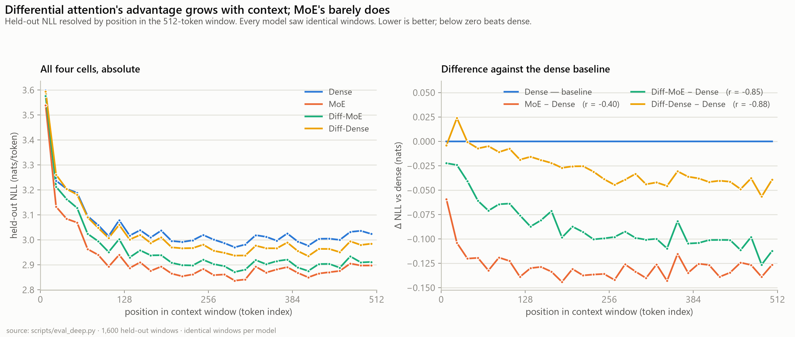

# Part 3 — What we measured, why those metrics, and what they'd mean in production

> **Build log, post 3 of 3.** [Part 1](part1-plan-and-moe-vs-diffmoe.md) and [Part 2](part2-diff-dense-vs-dense.md) reported *results*. This post is about the *instrument*: the six evaluation passes behind those numbers, why each metric was chosen over the obvious alternative, and — the part almost nobody writes down — what a 0.129-nat improvement actually buys you if you ship it.

| | |
|---|---|
| **Question** | If a model wins on your benchmark, what have you actually learned? |
| **Evaluation passes** | 6 scripts, ~90 GPU-minutes total on one RTX 3060 |
| **Models** | the completed 2×2 — Dense, Diff-Dense, MoE, Diff-MoE, all at 2,900 steps |
| **Protocol** | byte-identical windows for every model, every pass, fp32 |
| **Answer** | one number tells you almost nothing; six cheap ones tell you a great deal |

---

## Why this post exists

Most ablation writeups report a single held-out perplexity and stop. That number is real, but it answers exactly one question — *"which model assigns higher probability to this particular text?"* — and people routinely read four or five other questions into it:

- Will it be better on *my* data?
- Is it better *everywhere*, or better on average while worse in places?
- Did it improve for the reason the paper claims?
- Will the gain survive a different corpus mix?
- Does "better language model" mean "better at grammar"?
- What does it cost?

Every one of those is a different measurement. This project ran six passes because at this scale each costs minutes, and because — as it turned out — **four of the six produced results that a single perplexity number would have got wrong.**

The scripts, cheapest first:

| Pass | Script | Cost | Question it answers |
|---|---|---|---|
| 1 | `eval_all.py` | ~35 min | how good, overall and per domain |
| 2 | `eval_uncertainty.py` | ~12 min | is the difference bigger than sampling noise |
| 3 | `eval_bootstrap_clustered.py` | seconds, CPU | would it survive a different corpus mix |
| 4 | `eval_deep.py` | ~25 min | *where* in a sequence and *where* in the token distribution |
| 5 | `eval_attention.py` | ~4 min | is the mechanism actually engaged |
| 6 | `eval_blimp.py` | ~13 min | does the perplexity win transfer to linguistic competence |

---

## 1. The headline metrics — and why four, not one

Every model was scored on 3,200 windows (1.64M tokens) spread evenly across the 16.1M-token test split. **Byte-identical windows for every model**, which matters more than it sounds — see §2.

| Run | Test NLL | Perplexity | bits/byte | Top-1 |
|---|---|---|---|---|
| Dense | 3.0517 | 21.15 | 1.1306 | 46.21% |
| Diff-Dense | 3.0238 | 20.57 | 1.1203 | 46.61% |
| **MoE** | **2.9226** | **18.59** | **1.0828** | 47.03% |
| Diff-MoE | 2.9633 | 19.36 | 1.0979 | **47.06%** |

These are four views of the same forward pass. They are not redundant.

### Negative log-likelihood (nats/token) — the honest default

NLL is the training objective itself, unmodified. No threshold, no decoding strategy, no sampling temperature to tune — which means it is the one metric that cannot be gamed by evaluation choices.

**What a nat is.** NLL is measured in nats (natural-log units). One nat ≈ 1.44 bits. A model with NLL 3.05 is, on average, as uncertain about the next token as if it were choosing uniformly among *e*³·⁰⁵ ≈ 21 equally likely options.

**Why report it in nats rather than perplexity:** differences in NLL are *additive and comparable*. −0.129 nats means the same amount of improvement whether you started at 3.0 or 5.0. Perplexity ratios do not behave that way, which is why every statistical test in this project runs on NLL and only the presentation uses perplexity.

### Perplexity — the same number, for intuition

$$\text{PPL} = e^{\text{NLL}}$$

Read it as an **effective branching factor**: "how many equally-likely options is the model effectively choosing between?" 21.15 → 18.59 means the model narrowed its guess from ~21 plausible next tokens to ~18.6.

That is a **12.1% reduction**, from an NLL improvement of only 4.2%. Perplexity exaggerates — it is exponential in the thing you actually measured. Useful for intuition, misleading for comparison, and this is exactly why papers quote it.

### Bits per byte — the only number that survives a tokenizer change

This is the metric most small-LM writeups omit and shouldn't.

Perplexity is **per token**, and a token is whatever your tokenizer says it is. A model with a bigger vocabulary needs fewer tokens for the same text, so it gets a *better-looking* perplexity for free, without predicting anything better. Comparing perplexity across tokenizers is meaningless.

Bits per byte normalises by the underlying UTF-8 bytes:

$$\text{bits/byte} = \frac{\text{NLL} \times \log_2 e}{\text{bytes per token}}$$

**Why it matters here:** 37% of this model's parameters are its 100k embedding table. A planned future experiment compares that against an 8k vocabulary — and bits/byte is the *only* metric on this list that can make that comparison at all.

> **Real-world reading:** bits/byte is literally a compression rate. Dense encodes this corpus at 1.1306 bits per byte; MoE at 1.0828. If you used these as compressors, MoE's archive would be **4.2% smaller**. That is the entire quality difference, stated without exponentials or hype.

### Top-1 accuracy — the one a product manager understands

What fraction of the time is the model's single best guess exactly right? Dense 46.21%, MoE 47.03%.

NLL rewards putting probability mass in the right region; top-1 asks whether the argmax is correct. They can disagree — a model can improve its NLL substantially by being less wrong about tokens it was never going to get right.

> **Real-world reading:** in an autocomplete, top-1 is roughly your acceptance rate. MoE's +0.82pp means **about one extra accepted token per 122** — a real but unspectacular improvement, and a useful corrective to "12% better perplexity!" Differential attention's +0.40pp is one per 250.

**These two numbers, from the same models, would headline very differently.** That is the argument for reporting both.

---

## 2. Uncertainty — is the difference bigger than the noise?

A difference of 0.028 nats means nothing until you know how much the number moves by chance.

### Pairing is free and it changes everything

Because every model saw **byte-identical windows**, the comparison is *paired*: you can compute a per-window difference and bootstrap that, instead of comparing two independent averages. Window-to-window difficulty varies by nearly two nats across this corpus — pairing removes all of it.

The cost is one design decision made before any model trained: fix the eval offsets. The payoff is standard errors of 0.001–0.002 nats instead of something an order of magnitude larger.

| Comparison | Δ test NLL | 95% CI | Δ / SE | **Windows won** |
|---|---|---|---|---|
| MoE − Dense | −0.129 | [−0.134, −0.124] | 54σ | **96.0%** |
| Diff-Dense − Dense | −0.028 | [−0.030, −0.026] | 26σ | 69.2% |
| Diff-MoE − MoE | +0.041 | [+0.037, +0.045] | 19σ | 47.7% |

### The win rate is the column that changes decisions

The means say MoE's gain is ~4.6× differential attention's. The win rates say something completely different about their *character*:

- **MoE wins 96% of windows.** A broad shift of the entire distribution. Almost every passage improves.
- **Diff-Dense wins 69%.** Same direction, but it is **worse on nearly one window in three**. Its average is carried by a minority where it wins big.
- **Diff-MoE vs MoE wins 47.7%** — a coin flip. The +0.041 "deficit" is not a broad deficit at all; it is a near-tie with a heavy tail on one domain.

> **Real-world reading — and this is the practical core of the post.** These require different rollout decisions.
>
> A 96% win rate is safe to ship: whatever your traffic, it almost certainly improves.
>
> A 69% win rate means **a third of your users get a worse experience** even though your dashboard shows green. If you ship that on an average, you will get regression reports you cannot reproduce, because the average is genuinely better. You need per-segment evaluation before rollout.
>
> A 47.7% win rate with a positive mean means the difference is concentrated somewhere specific — find out where before concluding anything.
>
> **A mean cannot distinguish these three situations, and they are not the same decision.**

---

## 3. The resampling unit — the result that most surprised me

The intervals above resample the 3,200 windows independently. That assumes windows are interchangeable draws. **They aren't** — they come in six domains that differ by two nats in difficulty.

So the bootstrap was rerun resampling the **domains** instead. Same data, same estimator, same 20,000 resamples, one changed assumption:

| Comparison | Δ | iid 95% CI | **domain-clustered 95% CI** | width ratio |
|---|---|---|---|---|
| MoE − Dense | −0.129 | [−0.134, −0.124] | [−0.142, −0.051] | 9.6× |
| Diff-Dense − Dense | −0.028 | [−0.030, −0.026] | [−0.044, −0.016] | 6.5× |
| Diff-MoE − MoE | +0.041 | [+0.037, +0.045] | [**−0.016**, +0.055] | 8.6× |

Every interval widened 6.5–10.3×. And one conclusion **inverted**: Diff-MoE − MoE looked settled at 19 standard errors, and crosses zero once domains are the unit.

The two intervals answer genuinely different questions:

- **iid:** *"how much would this move on another sample of **this** corpus?"*
- **clustered:** *"how much would this move on a corpus with **different domains**?"*

> **Real-world reading:** your benchmark has a mixture. Your production traffic has a different mixture. The iid interval tells you nothing about that gap; the clustered one does. If your eval set is 40% support tickets and your traffic is 5% support tickets, an iid confidence interval is quietly answering a question you did not ask.
>
> In this project, the entire "MoE beats Diff-MoE" result lives in CHILDES, which is 40% of the test split. **On a corpus weighted differently, the sign is not safe.** That is a fact about the benchmark, not about the architecture — and the iid interval would never have told us.

It costs an afternoon and no GPU once per-window losses are cached. Almost nobody does it.

---

## 4. Position, calibration, and frequency — where the gain actually lands

`eval_deep.py` reuses the same forward pass to ask three orthogonal questions.

### NLL by position — the mechanism test

Score the loss *separately at each position* in the 512-token window.

> **Fig. 1 — Left:** all four cells, absolute. Every model is hardest at position 0 — no context to condition on — and all four flatten by ~position 128. **Right:** the same data as a difference against dense.

| | Δ at positions 0–31 | at 480–511 | corr. with position |
|---|---|---|---|
| **Diff-Dense − Dense** | **+0.010** *(behind!)* | **−0.048** | **r = −0.88** |
| MoE − Dense | −0.082 | −0.133 | r = −0.40 |

This is the metric that turns "it works" into "it works *for the stated reason*." A noise-cancelling mechanism must help more when there is more context to be distracted by — and differential attention starts *behind* at position 0 and builds its entire advantage across the window. A capacity mechanism has no such reason, and MoE indeed has most of its advantage by position 32.

> **Real-world reading:** this tells you **which workload the architecture suits**. If you serve long prompts — RAG, code, agent scratchpads, document QA — differential attention's benefit grows with your prompt length. If you serve short chat turns, you are paying for it and collecting almost nothing. That is a deployment decision a headline perplexity cannot inform, and it costs one extra evaluation pass.

### Calibration (ECE) — is the confidence earned?

Bucket every prediction by its confidence, and compare the model's stated confidence against how often it was actually right. Expected Calibration Error is the weighted average gap.

| | Dense | Diff-Dense | MoE | Diff-MoE |
|---|---|---|---|---|
| ECE | 0.0199 | 0.0202 | 0.0225 | 0.0217 |
| mean predictive entropy | 2.990 | 2.981 | 2.914 | 2.914 |

Near-identical across all four — a **negative result worth having**.

> **Real-world reading:** if you gate on model confidence — abstain below a threshold, escalate to a bigger model, route to a human — ECE is the number that governs whether those thresholds hold. Here it says the architecture choice **does not move your thresholds**. Swap the model, keep the gates. Had ECE moved, every downstream confidence threshold would have needed re-tuning, and nothing in the perplexity table would have warned you.

### Frequency deciles — which tokens got better

Bucket test tokens by their training-set frequency, then measure NLL per decile.

| Δ vs dense | rarest decile | most frequent decile |
|---|---|---|
| Diff-Dense | −0.144 | **+0.146** |
| MoE | −0.209 | −0.486 |

This explains the win-rate puzzle mechanically. **Differential attention trades common-token fluency for rare-token accuracy** — it is *worse* on the most frequent decile — which is precisely why it wins only 69% of windows while still winning on average. MoE improves both ends and wins 96%.

> **Real-world reading:** rare tokens are names, numbers, identifiers, technical terms. Frequent tokens are the connective tissue of fluent text. Differential attention is trading the second for the first. If your product is entity-heavy retrieval, that's the trade you want. If it's conversational fluency, it isn't.

### One probe that was discarded

A context-truncation probe — rescore the final token with only *k* tokens visible — was also run. It used 320 windows and one token each, giving a standard error around 0.06 nats against effects of ~0.02. **It is underpowered by 3×, it pointed the opposite way from the position analysis, and nothing is drawn from it.** Reporting the underpowered probe *as* underpowered is cheaper than quietly dropping it, and it stops a future reader rediscovering it and believing it.

---

## 5. Looking inside the mechanism

Everything so far measures *effects*. `eval_attention.py` measures the *cause* — it reimplements both attention forwards to capture the weight matrices the fused kernel never materialises (verified against the originals to 4.8×10⁻⁷ before trusting a number from it).

One wrinkle forced a metric choice. Standard attention rows are non-negative and sum to 1, so Shannon entropy is well defined. **Differential rows are signed and sum to 1−λ, so entropy is not defined on them at all.** Normalising the *magnitudes* |A|/Σ|A| is valid for both, and gives:

$$\text{effective support} = \exp\big(H(|A| / \textstyle\sum|A|)\big)$$

read as "roughly how many positions is this row really using?"

| Model | Effective support | Top-8 mass | **Negative attention mass** |
|---|---|---|---|
| Dense | 86.2 | 0.380 | 0 |
| Diff-Dense | 70.8 | 0.428 | **31.3%** |
| MoE | 75.6 | 0.419 | 0 |
| Diff-MoE | **50.2** | 0.503 | **32.4%** |

**Negative mass is the metric that matters**, and it exists because of a mathematical fact: a single softmax cannot produce a negative weight, ever. So negative mass is the one quantity that is *unambiguously* the new mechanism rather than a general property of a better-trained model. And λ predicts it almost perfectly across the 14 layers (r = +0.975 and +0.993).

That distinction was earned by running the control that could have embarrassed the story: **MoE, with ordinary softmax, also sharpened** (75.6 vs 86.2). Without it, "differential attention produces sharper attention" reads as a mechanism signature. With it, sharpening is revealed as a general property of better models here — and only the negative mass survives as uniquely differential.

> **Real-world reading:** this class of metric is what separates "we shipped a thing and the number moved" from "we know why the number moved." The second is what lets you predict where else it will work — which is the only reason to prefer a mechanism over a lucky hyperparameter.

---

## 6. BLiMP — does the perplexity win mean anything linguistic?

This project borrowed BabyLM's corpus but not its metric. BLiMP scores a model on 67,000 minimal pairs — a grammatical sentence against a minimally different ungrammatical one — and asks whether the model assigns the grammatical one higher total log-probability. Chance is 50%.

This is a **construct validity** check: perplexity is a proxy, and a proxy is only useful if it tracks the thing you care about.

| | Dense | Diff-Dense | MoE | Diff-MoE |
|---|---|---|---|---|
| **overall** | 70.50% | 70.62% | **71.39%** | 71.14% |
| semantics | 63.90% | **67.03%** | 64.21% | **67.40%** |
| syntax | 66.42% | 65.07% | 66.65% | 66.94% |
| morphology | 82.59% | 82.68% | 82.86% | 82.50% |

Two things, and the second is the most important number in the whole project.

**The ranking transfers exactly** (r = −0.99) — all four models order identically on grammar and on perplexity. **But the magnitudes compress hard:** a 0.129-nat NLL gap becomes 0.9pp of accuracy. Differential attention's overall +0.12pp is inside the binomial noise floor (~0.18pp).

**And by field, the effect replicated across architectures.** Adding differential attention moves semantics **+3.13pp** on a dense feed-forward and **+3.19pp** on a mixture of experts, while both standard-attention baselines sit near 64%. Two models sharing nothing but their attention mechanism, agreeing to 0.06pp on an effect 17× the noise floor.

> **Real-world reading:** a proxy metric moving does not guarantee the capability you want moved. Here it did transfer — but at roughly 7× compression, and *unevenly*. If you had picked this architecture for "better grammar" based on a perplexity win, you would have got about a seventh of what you expected overall, and three times what you expected on the specific thing (long-range semantic dependencies) you probably never thought to measure.

---

## 7. Cost — the metric that is always omitted

| Run | tok/s (2×T4) | Hours for 2,900 steps | Val NLL in a fixed 7.6 GPU-h |
|---|---|---|---|
| Dense | 6,944 | 7.6 h | 3.640 |
| **Diff-Dense** | 6,674 | 7.9 h | **3.613** |
| MoE | 5,250 | 10.1 h | 3.636 |
| Diff-MoE | 5,139 | 10.3 h | 3.620 |

Iso-step comparison isolates a mechanism. It is not what a budget buys. Give every run the same wall-clock and the ranking changes — Diff-Dense, third by final test NLL, is **first per GPU-hour**.

> **Real-world reading:** three axes — per step, per parameter, per hour — give three different winners from the same four runs. Which one is "correct" depends entirely on what is scarce for you. If you are compute-bound, iso-wall-clock is your metric and almost no paper reports it.

And a warning attached to this table: **differential attention's cost was first measured at 27%, and it is actually 2–4%.** The first measurement came from a contended shared GPU. A rerun at identical memory returned 5,139 tok/s. A cost measured once is a property of that *session*, not of the mechanism — and this project published the wrong number before catching it.

---

## What the whole battery does *not* tell you

Stating this plainly matters more than any of the above:

- **No instruction following, no factuality, no safety, no toxicity.** These are 209M-parameter base models trained on 190M tokens. None of those properties is measured, and none should be assumed.
- **One downstream task.** BLiMP is closed; GLUE-style probes are not.
- **No human evaluation.** Everything here is automatic.
- **One seed per cell.** This is the big one. Sampling error is nailed to 19–63σ; **run-to-run variance from a different random seed is entirely unmeasured.** Those are different problems and only the first is solved. The small differences in this post — differential attention's −0.028 nats — sit exactly in the range where seed noise could explain them.

That last point is why the next experiment in this project is not a bigger model. It is the same small models, several more times.

---

## The short version

| Metric | Costs | Tells you |
|---|---|---|
| NLL | free | how good, comparably and additively |
| perplexity | free | the same thing, intuitively, and exaggerated |
| bits/byte | free | how good, across different tokenizers |
| top-1 | free | roughly, your autocomplete acceptance rate |
| per-domain NLL | ~free | whether the average is hiding anything |
| paired bootstrap | 12 min | whether it beats sampling noise |
| **win rate** | free with the above | whether it's a broad win or a lopsided one — **the rollout decision** |
| **clustered bootstrap** | seconds, CPU | whether it survives a different corpus mix |
| NLL by position | one pass | which sequence lengths it suits |
| calibration / ECE | free with the above | whether your confidence thresholds still hold |
| frequency deciles | free with the above | which tokens got better — rare or common |
| attention statistics | 4 min | whether the mechanism is actually engaged |
| BLiMP | 13 min | whether the proxy tracks the capability |
| tok/s, GPU-hours | free, logged | what it costs |

Six passes, ~90 GPU-minutes, one card. **Four of them produced findings a single perplexity number would have got wrong:** the win-rate character, the clustered interval crossing zero, the position slope, and the semantics-versus-overall split on BLiMP.

The instrument is cheap. The alternative — one number, confidently reported — is how you end up shipping a regression to a third of your users and being unable to reproduce it.

---

*Differential-MoE build log · [Part 1 — the plan, and MoE vs Diff-MoE](part1-plan-and-moe-vs-diffmoe.md) · [Part 2 — does differential attention help on its own?](part2-diff-dense-vs-dense.md) · trained on the [BabyLM Challenge](https://babylm.github.io/) corpus, 2×T4 · evaluated on one RTX 3060 · every script referenced here is in `scripts/`, and every number is in `docs/blog/runs_export/`.*
