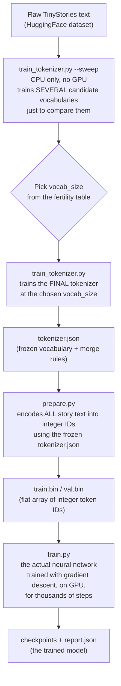

# Tokenizer training vs. model training

This project has two separate things called "training," run at different times, doing
completely different jobs. This confuses almost everyone the first time, because both
use the word "train" and both look at the same text data. This document walks through
what each one actually does, in what order, and why the order is not optional.

## The one-sentence version

- **Tokenizer training** decides how to chop text into a fixed vocabulary of chunks and
  assigns each chunk an integer ID. It runs once, on a CPU, in seconds to minutes, and
  never uses gradients or a GPU. When it's done, you have a static lookup table.
- **Model training** is the actual neural network learning to predict the next integer
  ID given the previous ones. It runs for hours, uses a GPU, uses gradient descent, and
  is the only stage that produces a "model" in the machine-learning sense.

The tokenizer is not part of the model. It is a preprocessing step that happens entirely
*before* the model exists, and its output (a vocabulary) is then frozen forever for that
model.

## Why you can't skip straight to model training

A transformer's first layer is an embedding table: a matrix of shape
`(vocab_size, dim)`, one row per possible token ID. That matrix's shape has to be fixed
the moment you construct the model (`src/model/transformer.py`, `nn.Embedding(vocab_size, dim)`).
You cannot construct that matrix without already knowing `vocab_size` — and
`vocab_size` is a property of the tokenizer, not the model. So the tokenizer has to
exist, completely finished, before the model can even be initialized, let alone trained.

This is the source of the confusion: it looks like one continuous pipeline ("process
text -> get a trained thing"), but it's really two independent stages with a hard
dependency in one direction only.

## What the tokenizer is actually learning

The tokenizer in this repo is a **byte-level BPE (Byte Pair Encoding)** tokenizer
(`src/data/train_tokenizer.py`). BPE is not a neural network — it's a compression
algorithm. Here is the entire idea, worked through on a toy example.

Suppose the training text is just the word `"lowlowlowlowerlowest"` repeated many
times. BPE starts by treating every individual character as a token:

```
l o w l o w l o w l o w e r l o w e s t
```

It then counts every adjacent pair of tokens and merges the most frequent pair into a
single new token. Say `"l"` followed by `"o"` is the most common pair — it becomes a
new token `"lo"`:

```
lo w lo w lo w lo w e r lo w e s t
```

Repeat: now `"lo"` followed by `"w"` is most common, merge into `"low"`:

```
low low low low e r low e s t
```

Keep repeating this merge step. Each merge adds exactly one new entry to the
vocabulary. You stop once the vocabulary reaches the target size (`vocab_size` — 4096
or 8192 in this repo's configs). The result is a list of merge rules plus a table
mapping each resulting chunk to an integer ID. That table and rule list is the entire
"trained" artifact — there are no weights, no loss function being minimized by gradient
descent, nothing that resembles model training. It's closer to building a smart lookup
table than to machine learning as usually meant.

Once training is done, encoding new text is deterministic: apply the merge rules in
order, then look up each resulting chunk's ID. Nothing changes or adapts after this
point — the tokenizer.json produced by this stage is frozen for the rest of the
project's life for that model.

## Why the vocabulary size is chosen by a sweep, not guessed

A bigger vocabulary means fewer tokens per word (better compression, shorter
sequences) but a bigger embedding table and a bigger output softmax — more parameters
spent on vocabulary instead of reasoning. There's a sweet spot, and it depends on the
dataset. `train_tokenizer.py --sweep` trains several candidate tokenizers (2048, 4096,
8192, 16384) and measures, on held-out text:

- **Fertility** — tokens produced per word. Lower is more efficient.
- **Bytes per token** — how much text one token represents, on average.

You look at where fertility stops dropping much per doubling of vocabulary size (the
"knee" of the curve) and pick that size. This sweep is cheap (CPU-only, no GPU, minutes)
precisely so you don't have to guess before spending any GPU time. See `docs/plan.md`
section 2 for the full rationale.

## The full pipeline, in order



Stage by stage, with the actual commands:

**Stage 1 — tokenizer sweep (comparison only, nothing is kept).**
```bash
python -m src.data.train_tokenizer --sweep --candidates 2048 4096 8192 16384
```
This trains four throwaway tokenizers just to print a comparison table. None of them
are saved. You read the table, decide on a `vocab_size`, and move on.

**Stage 2 — train and save the real tokenizer.**
```bash
python -m src.data.train_tokenizer --vocab_size 4096 --out data/tokenizer.json
```
This is the same BPE training algorithm, run once more at the chosen size, and this
time the result is written to disk. `data/tokenizer.json` now exists and will never be
retrained for this model. This step still has nothing to do with the neural network —
no model has been constructed yet, no GPU has been touched.

**Stage 3 — tokenize the whole dataset, once.**
```bash
python -m src.data.prepare --tokenizer data/tokenizer.json --out_dir data
```
This reads every story, encodes it into integer IDs using the frozen `tokenizer.json`,
and writes the entire result as one flat binary file of integers
(`data/train.bin`, `data/val.bin`). This is not training either — it's a deterministic
encoding pass, like gzip-ing a file. It happens once, and every subsequent model run
reads from these files directly, never touching raw text or the tokenizer again.

**Stage 4 — model training (the only stage that is actually "training" in the ML sense).**
```bash
python -m src.train --config configs/a_dense.yaml --data_dir data
```
Only now does `src/model/transformer.py` get constructed — and only now, because
`vocab_size` from the tokenizer has already been fixed by Stage 2, does the embedding
table's shape become well-defined. `src/train.py` reads integer IDs directly from
`train.bin`/`val.bin` (see `src/data/dataset.py`) — it never sees a single character of
raw text or interacts with the tokenizer at all. It runs forward passes, computes a
loss, backpropagates, and updates weights via AdamW, repeated for `max_steps`. This is
the expensive, GPU-bound, gradient-descent stage. Everything before it was
preprocessing.

## The key thing to internalize

> The tokenizer is trained once, produces a static file, and is then completely out of
> the picture. The model is trained many times longer, on the *output* of that static
> file, and never touches text directly.

If you ever want to change the vocabulary size, you have to redo Stages 1-3 and then
train the model **from scratch** — you cannot swap tokenizers under an already-trained
model, because its embedding table's shape is baked in at construction time and every
existing weight was learned against the old ID assignments.

## How this applies to the 2x2 ablation

All four tier-A ablation configs (`a_dense`, `a_diff`, `a_moe`, `a_diffmoe`) point at
the **same** `data_dir` — meaning they share the exact same `tokenizer.json`,
`train.bin`, and `val.bin`. The tokenizer is trained and the dataset is tokenized
**once**, and then all four model configs train independently on that identical,
frozen data. This is required for the ablation to be fair: if each run used a
different tokenizer, differences in the results could come from the data
representation instead of the architecture, which is exactly the confound the whole
parity methodology (`docs/plan.md`) exists to eliminate.

Tier B (`b_final.yaml`) uses a larger vocabulary (8192 vs. 4096) and therefore needs
its own tokenizer and its own tokenized dataset (`data_b/` rather than `data/`) — it is
not compared against tier A directly, so this doesn't break parity within either tier.
